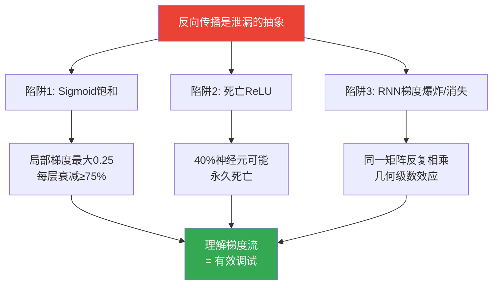

# Yes you should understand backprop | 你应该理解反向传播

> 📊 难度：⭐⭐⭐⭐ | ⏱️ 阅读：10分钟 | 📅 2016年12月 | 🏷️ 反向传播, 梯度消失, 死亡ReLU, 泄漏抽象

> **原标题**: Yes you should understand backprop
> **中文标题**: 是的，你应该理解反向传播——以及忽视它的代价
> **作者**: Andrej Karpathy
> **发表时间**: 2016年12月（原发于 Medium）
> **原文链接**: https://karpathy.medium.com/yes-you-should-understand-backprop-e2f06eab496b

---

## 📝 一句话摘要

反向传播不是一个可以安全抽象掉的"实现细节"——它是一个会泄漏的抽象，不理解它的人将无法有效构建和调试神经网络。

---

## 🔍 完整核心内容翻译

### 核心论点

Karpathy 在斯坦福开设 CS231n（深度学习课程）时，故意设计编程作业让学生**在最底层用纯 NumPy 实现反向传播**——手动完成每一层的前向和后向传递。这不是学术洁癖，而是必要的生存技能。

核心论断：**"反向传播的问题在于，它是一个泄漏的抽象（leaky abstraction）。"** 人们很容易掉入陷阱，以为可以把学习过程抽象掉——相信你只需要堆叠任意层，反向传播就会"魔法般地让它们工作"。

如果你因为"TensorFlow 会自动让你的网络学习"就忽视反向传播的工作原理，你将无法应对它带来的危险，在构建和调试神经网络时将大打折扣。

### 陷阱一：Sigmoid 饱和与梯度消失

当权重矩阵初始化过大时，Sigmoid 函数的输出会被推向 0 或 1 的极端——此时局部梯度 `z * (1 - z)` 趋近于零。

关键数字：**Sigmoid 的局部梯度最大值仅为 0.25**（在 z = 0.5 时达到）。这意味着每次梯度信号通过一个 Sigmoid 门，其幅度**至少减小为原来的四分之一**。

后果：如果使用基本的 SGD，网络的低层训练速度将远慢于高层。这就是经典的**梯度消失问题**。

**实践警告**：如果你在网络中使用 Sigmoid 或 Tanh 非线性函数，你应该**始终对初始化保持警觉**，确保它们不会导致全面饱和。

### 陷阱二：死亡 ReLU

ReLU（Rectified Linear Unit）的规则简单：正数通过，负数归零。但这带来了一个隐蔽的危险。

如果一个神经元在前向传播中被钳位到零（z = 0），它的权重将获得零梯度。这可能导致**"死亡 ReLU"问题**：

- 如果 ReLU 神经元的初始化不幸导致它永远不被激活
- 或者训练过程中一次大的参数更新将其权重推入了"死区"

那么这个神经元将**永远保持死亡**。它不再对任何输入做出响应，其参数永远不会更新。

**触目惊心的数字**：有时你会发现，将整个训练集通过一个训练好的网络前向传播后，**高达 40% 的神经元在所有样本上都输出零**——它们已经"死了"。

### 陷阱三：RNN 中的梯度爆炸/消失

在 RNN 中，梯度信号在时间上反向传播时，不断被**同一个矩阵**（循环权重矩阵 W_hh）乘以，中间穿插着非线性函数的反向传播。

这构成了一个几何级数：
- 如果矩阵的特征值 |b| < 1：梯度**指数级衰减到零**（消失）
- 如果 |b| > 1：梯度**指数级膨胀到无穷**（爆炸）

**实践结论**：如果你理解反向传播并使用 RNN，你会本能地对**梯度裁剪**保持警觉，或者直接选用 LSTM（其门控机制专门设计来缓解这个问题）。

### 深层信息

Karpathy 的核心论点不仅仅是关于具体的技术陷阱——它是关于一种**认知态度**：

深度学习框架（TensorFlow、PyTorch 等）提供了强大的自动微分功能，让使用者不必手动计算梯度。但这种便利创造了一种危险的幻觉：以为梯度计算是完全自动化的、不需要关心的。

实际上，**自动微分只是正确计算梯度**——它不能保证梯度的数值行为（太大、太小、全零）是健康的。理解反向传播意味着理解**梯度流**，而梯度流决定了你的网络能否有效学习。

---

## 🔬 技术要点

1. **Sigmoid 梯度瓶颈**：Sigmoid 局部梯度最大仅 0.25，每经过一层至少衰减 75%，深层网络中梯度指数级消失
2. **死亡 ReLU 是永久性的**：一旦 ReLU 神经元的激活区间被推入负数区域，它将永远不产生梯度、永远不更新——一种不可逆的"神经元死亡"
3. **RNN 梯度的几何级数效应**：循环权重矩阵的反复相乘导致梯度要么消失要么爆炸，LSTM 的门控机制是对此问题的工程解决方案
4. **自动微分 ≠ 健康梯度**：框架保证梯度计算的正确性，但不保证梯度的数值稳定性——后者需要人类的理解和干预

---

## 🧠 深度解读

### 🟢 通俗版

这篇文章可以看作 Karpathy 教育哲学的宣言。作为斯坦福 CS231n 的核心教师，他亲眼见证了一代又一代学生在深度学习框架的便利性中失去了对底层机制的理解。

### 🔴 深入版

文章的标题 "Yes you should understand backprop" 带有一种回应论战的语气——当时确实有声音认为，既然框架已经自动化了反向传播，从业者不需要理解它的细节。Karpathy 的回应是断然的：**不，你必须理解**。

从更宏观的角度看，这篇文章触及了一个永恒的工程话题：**抽象的代价**。每一层抽象都简化了上层的工作，但也隐藏了潜在的故障模式。当抽象"泄漏"时——梯度消失、神经元死亡——只有理解底层机制的人才能诊断和修复。

到了 LLM 时代（2025-2026），这个论点是否仍然成立？一方面，现代 Transformer 的训练已经高度工程化，很多 Karpathy 警告的具体问题（如 Sigmoid 饱和）已不常见。另一方面，**新的"泄漏"不断出现**——注意力模式退化、KV 缓存内存爆炸、混合精度训练的数值不稳定性——理解底层梯度流的人仍然拥有巨大的调试优势。

更深层地说，Karpathy 的论点可以推广为：**在任何快速发展的技术领域，理解底层原理的人都比仅会使用工具的人走得更远**。这不仅适用于反向传播，也适用于 prompt engineering、RAG 架构、Agent 系统等当代 AI 工程的每一个层面。

---

## 💡 延伸思考

1. **理解的粒度**：Karpathy 要求学生用 NumPy 手写反向传播。在 2026 年，一个 AI 工程师需要理解到什么粒度？是否需要理解 FlashAttention 的 CUDA 内核？还是理解注意力机制的数学就够了？

2. **AI 教育的范式变革**：如果 AI 本身可以解释反向传播、诊断梯度问题，人类是否还需要"理解"这些？或者说，"理解"的含义本身正在改变？

3. **泄漏抽象的进化**：ReLU 解决了 Sigmoid 的问题，LSTM 解决了 vanilla RNN 的问题，Transformer 解决了 LSTM 的问题。但每一层新抽象都带来新的泄漏点。当前 Transformer 架构最大的"泄漏"在哪里？

4. **从反向传播到强化学习**：Karpathy 的论点集中在监督学习的反向传播上。在 RLHF/RLVR 成为 LLM 训练关键阶段的今天，"你应该理解强化学习"是否同样紧迫？
