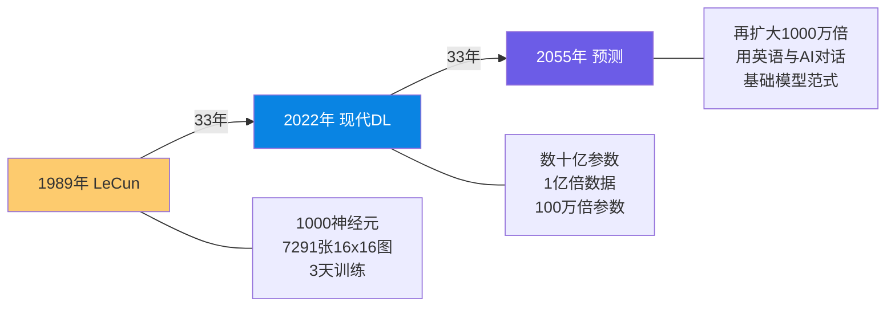

# Deep Neural Nets: 33 years ago and 33 years from now | 深度神经网络：33年前与33年后

> 📊 难度：⭐⭐⭐ | ⏱️ 阅读：14分钟 | 📅 2022年3月14日 | 🏷️ 深度学习历史, LeCun 1989, 规模定律, 基础模型

> **原标题**: Deep Neural Nets: 33 years ago and 33 years from now
> **中文标题**: 深度神经网络的33年：从 LeCun 1989 到 2055 的时间旅行
> **作者**: Andrej Karpathy
> **发表时间**: 2022年3月14日
> **原文链接**: https://karpathy.github.io/2022/03/14/lecun1989/

---

## 📝 一句话摘要

通过用现代 PyTorch 复现 1989 年 LeCun 的手写数字识别论文，Karpathy 展示了 33 年间深度学习的核心算法几乎未变，而变化的是规模——并由此推演 2055 年的 AI 景象。

---

## 🔍 完整核心内容翻译

### 实验设计：复现 1989

Karpathy 选择了 LeCun 等人 1989 年的经典论文——将反向传播应用于手写数字识别。这篇论文训练了一个微小的神经网络：仅 1000 个神经元，在 7291 张 16x16 灰度图像上训练。尽管如此，论文的结构与现代深度学习研究论文如出一辙：数据集描述、架构、损失函数和实验结果。

**原始性能**：
- 训练误差：0.14%（10 个错误）
- 测试误差：5.00%（102 个错误）

### 硬件加速：3000 倍

原始训练在 SUN-4/260 工作站上耗时 3 天。在 M1 MacBook Air 的 CPU 上运行，仅需 90 秒——**约 3000 倍的朴素加速**，甚至还没有使用 GPU。

### 逐步应用现代改进

Karpathy 保持 1989 年的小模型和数据集不变，逐步应用现代技术改进：

| 改进步骤 | 具体操作 | 测试误差 |
|---------|---------|---------|
| 原始复现 | 1989 架构 + MSE 损失 | ~5.0% |
| 损失函数 | MSE → 交叉熵 | 大幅降低，但严重过拟合 |
| 优化器 | SGD → AdamW | 微小额外增益，但优化更稳定 |
| 数据增强 | ±1 像素偏移 | 2.19% |
| 正则化 | Dropout + ReLU 激活 | 1.59%（仅 32 个错误） |
| 延长训练 | 补偿正则化引入的噪声 | 进一步改善 |

**结论**：在保持推理速度和小模型尺寸的同时，误差率降低了约 60%。

### 数据规模的力量

使用完整 MNIST 数据集（50,000 个样本），配合现代技术，测试误差降至 1.25%（仅 24 个错误）——证明数据集大小本身就能驱动显著改进。

### 宏观反思：什么变了，什么没变

**不变的**：
- 核心架构未变：分层神经元通过反向传播优化——这仍然是基本范式
- 训练循环不变：前向传播 → 计算损失 → 反向传播 → 参数更新

**变化的（纯粹是规模）**：
- 现代数据集：比 1989 年多约 **1 亿倍**的像素数据
- 现代网络：约 **100 万倍**的参数
- 硬件加速：仅通过硬件就有 3000 倍；加上 GPU 可再提升 100 倍
- 算法改进：不改变基础设施也能将误差率减半

### 推演 2055 年

Karpathy 大胆推测 2055 年的 AI 景象：

神经网络在本质上将与 2022 年的模型"基本相似"，但规模将扩大约 **1000 万倍**——无论是模型参数还是训练数据。2022 年的实践在 2055 年的研究者看来将显得原始。

### 最深刻的洞察：基础模型范式转移

Karpathy 观察到一个正在发生的根本性转变：**从训练任务特定模型，转向使用由资源充足的机构训练的大规模基础模型**。

未来的用户将通过微调（fine-tuning）、提示工程（prompt engineering）或模型蒸馏（distillation）来使用这些基础模型，而非从零训练。

**终极预言**：

> "到 2055 年，你将对一个规模扩大 1000 万倍的神经网络巨脑发出指令——通过说话（或思考），用英语。训练自定义模型将变得不再必要——与预训练的超级模型互动将取代传统的模型开发。"

---

## 🔬 技术要点

1. **核心算法 33 年未变**：反向传播、梯度下降、分层神经元——1989 年的基本范式在 2022 年仍是核心，变化的只是规模
2. **现代改进的边际效应**：交叉熵损失、AdamW、Dropout、ReLU、数据增强——每一步都提供了可量化但有限的改进；真正的飞跃来自规模
3. **硬件加速是被低估的驱动力**：3000 倍的 CPU 加速 + 100 倍的 GPU 加速 = 30 万倍的总计算提升，这是过去 33 年进步的最大单一因素
4. **基础模型范式**：从"每个任务训练一个模型"到"一个模型服务所有任务"——这是深度学习领域最重要的范式转移
5. **数据规模 vs 算法创新**：更多数据带来的收益始终大于更好算法带来的收益——这一经验法则在 33 年间始终成立

---

## 🧠 深度解读

### 🟢 通俗版

这篇文章的精妙之处在于它的**方法论**：不是空洞地讨论 AI 的未来，而是通过严格的历史复现实验来校准预测。Karpathy 把 1989 年的论文当作一面镜子，照出 33 年的变与不变。

### 🔴 深入版

最深刻的发现是令人不安的：**核心算法几乎没有进步**。我们仍然在做反向传播，仍然在用梯度下降，仍然在堆叠神经元层。变化的只是规模——更多的数据、更大的模型、更快的硬件。这暗示了一种"暴力美学"的胜利：不是更聪明的算法，而是更大的规模在驱动进步。

基础模型的预言在文章发表后不到一年就被 ChatGPT 彻底验证。到了 2025-2026 年，Karpathy 的预测已经成为现实：绝大多数 AI 应用不再从零训练模型，而是通过 API 调用或微调大型基础模型。

对 2055 年的推演带有一种科幻般的克制——不是预测 AGI 或超级智能，而是简单地将规模曲线外推。这种"无聊"的预测可能恰恰是最准确的：如果过去 33 年的模式继续，未来 33 年的变化将主要由规模驱动，而非范式革命。

---

## 💡 延伸思考

1. **Scaling Laws 的极限**：Karpathy 的推演隐含了 Scaling Laws 在 33 年内持续有效的假设。但物理限制（芯片制程、能源消耗、数据枯竭）是否会在 2055 年前就打断这条曲线？

2. **算法创新被低估了吗？**：文章强调规模是主要驱动力，但 Transformer 的出现（2017）是否是一个反例？没有注意力机制的架构创新，单纯的 RNN 规模化能达到 GPT-4 的水平吗？

3. **基础模型的政治经济学**：如果 AI 的未来是少数机构训练的基础模型被全世界使用，这对技术权力的集中意味着什么？开源基础模型（如 Llama）是否足以对冲这种集中化？

4. **"用英语与 AI 对话"的深意**：Karpathy 预测未来人们将用自然语言与 AI 互动。这在 2025 年已经成真。但这是否意味着编程技能将变得过时？还是说编程将演化为一种更高层的系统设计能力？
