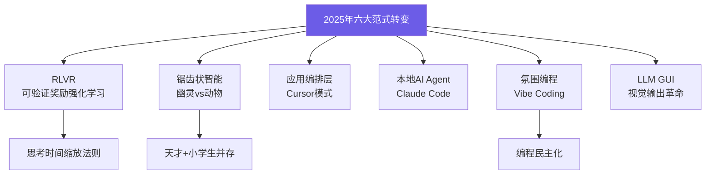

# 2025 LLM Year in Review | 2025年LLM年度回顾

> 📊 难度：⭐⭐⭐ | ⏱️ 阅读：18分钟 | 📅 2025年12月19日 | 🏷️ LLM年度回顾, RLVR, 氛围编程, 锯齿状智能

> **原标题**: 2025 LLM Year in Review
> **中文标题**: 2025 年 LLM 年度回顾：六大范式转变重塑 AI 格局
> **作者**: Andrej Karpathy
> **发表时间**: 2025年12月19日
> **原文链接**: https://karpathy.bearblog.dev/year-in-review-2025/

---

## 📝 一句话摘要

2025 年是 LLM 领域"强劲且事件频发"的一年——六大范式转变（RLVR、幽灵智能、应用层崛起、AI 驻留本地、氛围编程、LLM GUI）共同重塑了整个 AI 产业的格局。

---

## 🔍 完整核心内容翻译

### 总论

Karpathy 将 2025 年定性为"进步强劲且事件频发的一年"，识别出六个重大范式转变。

---

### 范式一：基于可验证奖励的强化学习（RLVR）

传统 LLM 生产管道包含三个阶段：预训练、监督微调和 RLHF。2025 年，**RLVR（Reinforcement Learning from Verifiable Rewards）** 作为重要的新阶段登场。

**核心机制**：模型在客观可验证的奖励（数学/代码题的正确性）上训练，从而自发发展出类似"推理"的策略。

> "LLM 自发地发展出对人类而言看起来像'推理'的策略——它们学会将问题求解分解为中间计算步骤。"

**关键区别**：与较短的微调阶段不同，RLVR 涉及对**不可博弈的奖励信号**进行延长优化，消耗了原本分配给预训练的算力。能力增长来自**更长的 RL 运行**而非更大的模型。

这引入了一种新的"思考时间"缩放法则（test-time compute scaling），可在推理阶段通过控制计算量来调节模型能力。

---

### 范式二：幽灵 vs 动物 / 锯齿状智能

Karpathy 提出了一个深刻的认知框架：**LLM 是与生物智能根本不同的实体**。我们不是在"进化动物"，而是在"召唤幽灵"——它们拥有完全不同的神经架构、训练数据和优化压力。

**"锯齿状智能"（Jagged Intelligence）** 是核心概念：LLM 同时展现出**天才博学者**和**挣扎的小学生**两种面貌。它们在可验证的领域表现突出，但整体能力分布参差不齐。

**基准测试的信任危机**：Karpathy 表达了对 2025 年基准测试的"冷漠和信任丧失"。基准测试本身变得容易被 RLVR 优化——在测试集上训练已成为标准做法。

相关深入文章：《动物 vs 幽灵》《可验证性》《心智空间》。

---

### 范式三：Cursor / LLM 应用新层级

Cursor 的崛起揭示了一个独特的**应用编排层**。这类应用的核心工作包括：
- **上下文工程**（Context Engineering）
- 在复杂 DAG 中编排多次 LLM 调用
- 应用特定的 GUI 设计
- **自主性滑块**（Autonomy Sliders）——控制 AI 的自主程度

Karpathy 预测：LLM 实验室将生产通用能力模型，而应用开发者将把这些能力专业化到具体垂直领域，将模型与私有数据、传感器、执行器和反馈机制结合。

---

### 范式四：Claude Code / AI 驻留在你的电脑上

Claude Code 通过扩展的工具使用和推理循环，展示了令人信服的 LLM Agent 能力。其革命性之处：**它运行在用户本地电脑上**，而非云端容器中。

Karpathy 批评了 OpenAI 的"云优先"策略，认为鉴于当前的锯齿状能力，**本地部署更有意义**。范式转变的关键不在于计算发生在哪里，而在于**访问现有系统、上下文、数据、秘密**，以及实现低延迟交互。

他将此描述为与基于网站的 AI 根本不同的体验——**"一个'住在'你电脑里的小精灵/幽灵"**。

---

### 范式五：氛围编程（Vibe Coding）

> "AI 跨越了一个能力阈值——仅通过英语就能构建令人印象深刻的程序，忘记代码的存在。"

**氛围编程**将编程民主化，超越了受过训练的专业程序员群体。Karpathy 指出这体现了他的论文《权力归于人民：LLM 如何颠覆技术扩散》的核心观点——**普通人从 LLM 中获得的收益不成比例地大于专业人士和机构**。

三个层次的价值：
1. **赋能非程序员**：让不会编程的人也能构建应用
2. **扩展专业人士**：让程序员能创建原本不值得写的软件
3. **一次性代码**：使代码变得短暂和一次性

实践案例：自定义 BPE 分词器、menugen、llm-council、reader3、HN 时间胶囊。

---

### 范式六：Nano Banana / LLM GUI

Google 的 Gemini Nano Banana 代表了一个范式转移性的模型，展示了 LLM 构成了**堪比 1970-80 年代计算机的重大计算变革**。

**核心论点**：文本是计算机的原生格式，但对人类消费而言很糟糕。正如 GUI 革命改变了传统计算，LLM 也应该通过视觉方式沟通——图像、信息图表、幻灯片、动画、Web 应用。

关键技术突破：Nano Banana 将**"文本生成、图像生成和世界知识全部纠缠在模型权重中"**，创造了集成的多模态能力，而非分离的系统。

---

### 总结与展望

Karpathy 强调 LLM 仍然"极其有用"，行业意识到"即使在当前能力水平上，我们连 10% 的潜力都没有发挥出来"。

他保持着一种矛盾但诚实的立场：**同时期待快速的持续进步，又认为大量工作仍待完成**——"这个领域感觉仍然广阔开放。"

**TLDR**：2025 年证明了 LLM 同时比预期更强大也更有限，展示出锯齿状的智能模式。尽管在基准测试上表现碾压，真正的 AGI 仍然遥远，但潜在应用几乎是无限的。

---

## 🔬 技术要点

1. **RLVR 是 2025 年最重要的训练范式创新**：通过在可客观验证的奖励上进行延长强化学习，LLM 自发发展出推理策略，引入了"思考时间"这一新的缩放维度
2. **锯齿状智能是 LLM 的本质特征**：LLM 不是均匀的"通用智能"，而是在不同能力维度上呈现极度不均匀的分布——某些方面超人类，某些方面不如小学生
3. **应用编排层的崛起**：Cursor 式应用代表了一个新的软件层级——不是 LLM 本身，而是编排 LLM 调用、管理上下文、控制自主度的中间件
4. **本地 AI Agent 优于云端 AI**：访问本地文件系统、开发环境、密钥等上下文信息的能力，使本地运行的 AI Agent 在实用性上超越了云端沙箱方案
5. **LLM 需要视觉输出革命**：文本是 LLM 的原生格式但不是人类的原生格式——多模态输出（图表、应用、动画）将成为 LLM 应用的重要发展方向

---

## 🧠 深度解读

### 🟢 通俗版

这篇年度回顾展现了 Karpathy 独特的认知角色——他既是深度技术专家，又是出色的概念框架构建者。他不是在列举 2025 年发生了什么，而是在提供**理解这些事件的思维框架**。

### 🔴 深入版

**"幽灵 vs 动物"** 可能是 2025 年最有影响力的 AI 比喻。它提供了一种理解 LLM 能力与局限性的方式，避免了两种常见的认知陷阱：既不把 LLM 神化为"类人智能"，也不贬低为"仅仅是统计模式匹配"。LLM 是一种全新的存在——我们用培养动物的方式召唤了幽灵，幽灵有幽灵的长处和短处。

**RLVR 的意义**远超技术本身。它意味着 LLM 的能力来源正在从"数据质量"转向"训练时间"——这类似于 AlphaGo 从监督学习转向自我对弈的飞跃。可验证奖励的使用也暗示了一个重要趋势：AI 在可验证领域（数学、编程、逻辑推理）的进步将远快于不可验证领域（创意写作、社交智能、常识判断）。

**氛围编程**的概念尤其值得关注——这个由 Karpathy 在 2025 年初创造的术语已经成为行业标准词汇。它捕捉到了一个历史性的拐点：编程从精英技能变为大众能力。这不是"低代码/无代码"的老生常谈——那些平台限制你只能做预设的事情，而氛围编程允许你构建**任何你能用语言描述的东西**。

从 Karpathy 个人立场的角度看，这篇文章也值得玩味：他对 Claude Code 的高度评价和对 OpenAI 云优先策略的批评，暗示了他对 AI 产业发展方向的判断——**开放、本地、赋能个体**优于**封闭、云端、中心化控制**。

---

## 💡 延伸思考

1. **RLVR 的天花板**：RLVR 依赖可验证的奖励信号（数学题的对错、代码的通过率）。但人类最有价值的智力活动（科学假设生成、战略决策、创意表达）往往缺乏客观验证标准。RLVR 范式能突破可验证领域的边界吗？

2. **锯齿状智能的哲学含义**：如果 LLM 在某些维度超越所有人类但在其他维度不如儿童，我们应该如何定义"智能"？是否需要一种全新的智能分类学来描述这种前所未有的能力分布？

3. **应用层 vs 模型层的价值分配**：如果 LLM 实验室提供通用模型，应用公司提供垂直解决方案，长期的价值和利润将如何在这两层之间分配？历史上，平台通常赢者通吃——LLM 领域是否会重复这一模式？

4. **AI 的物理化**：Karpathy 强调 AI 需要访问本地系统、传感器、执行器。这暗示了 AI 从"纯数字存在"向"物理世界嵌入"的演进。机器人学是否即将迎来由 LLM 驱动的爆发？
