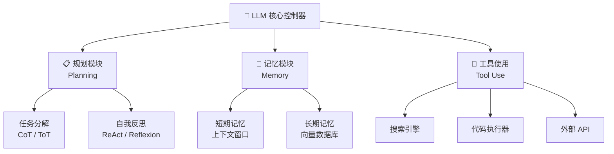
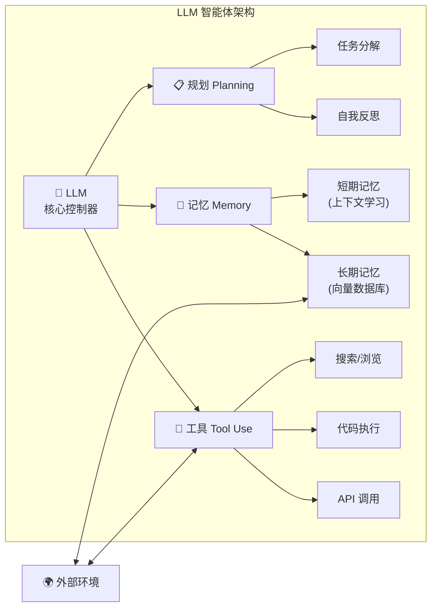
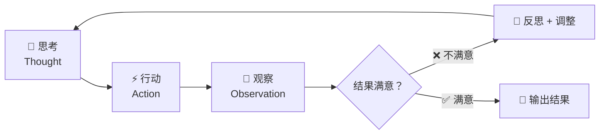
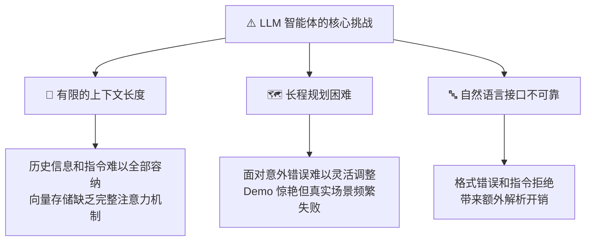

# LLM Powered Autonomous Agents | LLM 驱动的自主智能体

> ⭐⭐⭐ 较高难度 | ⏱️ 阅读时间：18 分钟 | 📅 2026-03-21 | 🏷️ `智能体` `规划` `记忆` `工具使用` `ReAct` `AutoGPT`

> **作者**: Lilian Weng（翁荔）| **发布日期**: 2023年6月23日
>
> **一句话摘要**: 本文系统性地剖析了以大语言模型为核心控制器的自主智能体架构，将其分解为规划（Planning）、记忆（Memory）和工具使用（Tool Use）三大核心模块，并通过 AutoGPT、BabyAGI 等案例深入探讨了该范式的潜力与局限。

---

## 🟢 通俗版：LLM 智能体是什么？

想象你有一个超级聪明的助手：

- 🧠 **大脑**（LLM）：能理解和生成语言
- 📋 **规划能力**：能把大任务拆成小步骤
- 📝 **记忆力**：能记住之前做过什么
- 🧰 **工具使用**：能上网搜索、写代码、调用 API

把这些能力组合起来，就是 **LLM 驱动的自主智能体** —— 不只是聊天，而是能**自主完成复杂任务**的 AI 系统。

> 🎯 **关键比喻**：如果 ChatGPT 是一个"顾问"（你问什么答什么），那么智能体就是一个"员工"（你交代任务，它自己拆解、执行、反馈）。

---

## 🔴 深入版：核心内容详解

### 1. 🏗️ 智能体系统总体架构

翁荔将 LLM 驱动的自主智能体定义为一个以大语言模型为"大脑"的系统，其核心能力由三个相互协作的模块构成：

- **📋 规划（Planning）**：将复杂任务分解为可执行的子目标，并通过自我反思不断优化决策。
- **📝 记忆（Memory）**：包括短期记忆（上下文学习）和长期记忆（外部向量数据库），让智能体突破上下文窗口的限制。
- **🧰 工具使用（Tool Use）**：学会调用外部 API 和工具，获取训练数据之外的信息，执行代码等操作。

### 2. 📋 规划模块：从任务分解到自我反思

#### 🧩 任务分解方法

| 方法 | 结构 | 核心思想 | 优势 |
|------|------|---------|------|
| 🔗 思维链 (CoT) | 线性链 | "让我们一步步思考" | 简单通用 |
| 🌳 思维树 (ToT) | 树状分支 | 多路径探索 + 回溯 | 处理复杂搜索 |
| 🤖 LLM+P | 外包规划 | 使用 PDDL 经典规划器 | 长程规划 |

#### 🔄 自我反思机制

- **⚡ ReAct 框架**：通过"思考 -> 行动 -> 观察"的结构化循环，将推理与行动紧密结合。
- **🔄 Reflexion**：采用动态记忆和自我反思，通过启发式规则识别低效轨迹或幻觉（例如连续相同动作产生相同观察结果）。
- **📜 后见之明链（Chain of Hindsight）**：用过往输出及其反馈标注来微调模型，实现渐进式改进。
- **🧬 算法蒸馏（Algorithm Distillation）**：将强化学习中的后见之明概念应用到多回合学习历史的上下文拼接中。

### 3. 📝 记忆模块：从人类认知到向量检索

文章将人类大脑记忆类型映射到智能体系统中：

| 人类记忆类型 | 智能体对应 | 特征 | 容量 |
|---|---|---|---|
| 👁️ 感觉记忆 | 嵌入表示 | 原始输入的学习表征 | 极大 |
| 🧠 短期/工作记忆 | 上下文学习 | 受限于有限的上下文窗口 | 有限 (4K-128K tokens) |
| 💾 长期记忆 | 外部向量存储 | 支持快速检索的持久化存储 | 理论无限 |

#### 🔍 MIPS 近似最近邻算法对比

| 算法 | 原理 | 特点 |
|------|------|------|
| 🔑 LSH | 局部敏感哈希 → 相似项映射到同一桶 | 简单高效 |
| 🌲 ANNOY | 随机投影树 → 层次化搜索 | 内存友好 |
| 🌐 HNSW | 多层小世界图 → 层级导航 | 查询速度快 |
| 📊 FAISS | 聚类分区 + 向量量化 | 大规模适用 |
| 🎯 ScaNN | 各向异性向量量化 → 优化内积 | 精度最高 |

### 4. 🧰 工具使用模块：连接数字世界的桥梁

| 系统/框架 | 核心机制 | 特点 |
|-----------|---------|------|
| 🔀 MRKL | LLM 路由查询到专家模块 | 神经网络 + 符号系统 |
| 🛠️ TALM / Toolformer | 微调模型学会 API 调用 | 自主学习工具使用 |
| 🤗 HuggingGPT | 四阶段框架 | 任务规划→模型选择→执行→生成 |
| 📊 API-Bank | 三层评估基准 | 基础调用→API检索→多步规划 |

### 5. 📖 案例研究

#### 🧪 科学发现领域
- **🧪 ChemCrow**：为 LLM 配备 13 种化学工具，用于合成和药物发现。人工评估显示其表现显著优于单独的 GPT-4，揭示了 LLM 评估在专业领域的局限性。
- **🔬 Boiko 等人的研究**：展示了智能体处理自主实验设计的能力，但也暴露了安全隐患（化学武器测试集中 36% 的合成请求被接受）。

#### 🎮 生成式智能体模拟
- **🏘️ Park 等人的项目**：在沙盒环境中控制 25 个 AI 角色，结合记忆流、检索模型、反思机制和规划/反应能力。涌现出信息扩散、关系记忆和社交活动协调等行为。

#### 🛠️ 概念验证
- **🤖 AutoGPT**：在约 4000 词的上下文限制内运行，提供 20 种命令（搜索、文件操作、代码分析），强调性能评估和自我批评。
- **💻 GPT-Engineer**：通过多轮对话澄清需求，然后通过明确的架构规划生成完整的功能代码库。

### 6. ⚠️ 面临的挑战

- **📏 有限的上下文长度**：限制了历史信息和详细指令的容纳；向量存储缺乏完整注意力机制的能力。
- **🗺️ 长程规划困难**：LLM 在面对意外错误时难以像人类那样灵活调整计划。
- **🔤 自然语言接口的不可靠性**：格式错误和偶尔的指令拒绝给实际部署带来额外的解析开销。

---

## 🧪 技术要点

1. **🏗️ 三位一体架构**：规划 + 记忆 + 工具使用构成了 LLM 智能体的完整能力栈，其中记忆模块弥补了上下文窗口的硬性限制。
2. **🔄 自我反思是规划的关键**：ReAct、Reflexion 等机制让智能体从失败中学习，而非盲目重试。
3. **💾 向量检索是长期记忆的基础设施**：HNSW、FAISS 等 ANN 算法是将海量知识高效关联到当前任务的技术支柱。
4. **🧰 工具使用扩展了能力边界**：从搜索引擎到代码执行器，工具让 LLM 从"知识容器"升级为"行动者"。
5. **🔐 安全性不容忽视**：ChemCrow 案例中化学武器合成请求的接受率警示了自主智能体的安全风险。

---

## 🔬 深度解读

翁荔这篇文章发表于 2023 年 6 月——正是 AutoGPT 引发全球关注的热潮之中。与当时的炒作不同，她冷静地将智能体系统解构为三个可分析、可工程化的模块，避免了"AGI 即将到来"的论调。

🔍 文章最具洞见的部分在于对**挑战**的坦诚分析。她指出 LLM 在长程规划上的根本性弱点——不是靠增加上下文窗口就能解决的，而是模型在面对不确定性和动态变化时的推理能力不足。这一判断在后续两年的实践中被反复验证：大量基于 LLM 的智能体项目在 Demo 阶段表现惊艳，但在真实场景中频繁失败。

🧠 记忆模块的设计尤其值得关注。翁荔将人类认知科学中的感觉记忆、工作记忆、长期记忆三分法引入智能体架构，这不仅是优雅的类比，更指出了一个工程路径：不同类型的信息需要不同的存储和检索策略。

### 📊 智能体框架演进对比

| 时间 | 框架 | 核心特点 | 局限 |
|------|------|---------|------|
| 2023 Q1 | 🤖 AutoGPT / BabyAGI | 单智能体，自主循环 | 容易陷入死循环 |
| 2023 Q2 | ⚡ ReAct / Reflexion | 结构化推理+反思 | 仍受上下文限制 |
| 2023 Q4 | 👥 MetaGPT / CrewAI | 多智能体协作 | 协调开销大 |
| 2024 | 🔧 Claude Code / Devin | 专业化 Agent | 领域限制 |
| 2025 | 🌐 MCP 生态 | 标准化工具协议 | 生态仍在建设中 |

---

## 💭 延伸思考

- **🧠 智能体的"系统二"困境**：当前 LLM 智能体本质上仍是快速反应式的（系统一），真正的深度规划和推理（系统二）可能需要全新的架构范式，而非简单的提示工程。
- **🗑️ 记忆的涌现与遗忘**：生成式智能体模拟中的涌现行为令人兴奋，但真正有用的智能体可能还需要"主动遗忘"的能力——知道什么该记、什么该忘。
- **🔐 工具使用的安全边界**：随着智能体能调用的工具越来越多、越来越强大，"最小权限原则"和"人类在环"设计将变得至关重要。
- **👥 从单智能体到多智能体协作**：本文聚焦单智能体架构，但多智能体协作（如 MetaGPT、CrewAI 等后续工作）正在成为新的研究热点。

---

## 🔗 原文链接

[LLM Powered Autonomous Agents - Lil'Log](https://lilianweng.github.io/posts/2023-06-23-agent/)
