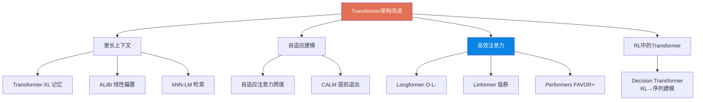

# The Transformer Family Version 2.0 | Transformer 家族 2.0 版

> 📊 难度：⭐⭐⭐⭐⭐ | ⏱️ 阅读：22分钟 | 📅 2023年1月27日 | 🏷️ Transformer, 注意力机制, 位置编码, 高效架构

> **作者**: Lilian Weng（翁荔）| **发布日期**: 2023年1月27日
>
> **一句话摘要**: 本文是 Transformer 架构改进的百科全书式综述，系统梳理了自 2020 年以来在更长上下文、自适应建模、高效注意力、强化学习应用等方向上的关键创新，是理解现代大模型架构演进的必读文献。

---

## 一、🔍 核心内容翻译

### 1. Transformer 基础回顾

翁荔首先回顾了 Transformer 的基本组件：

- **缩放点积注意力（Scaled Dot-Product Attention）**：注意力的核心计算，通过查询（Q）、键（K）、值（V）的点积来计算注意力权重，并除以 √d_k 进行缩放。
- **多头注意力（Multi-Head Attention）**：将输入投影到多个子空间，并行计算注意力后拼接，让模型同时关注不同表示子空间中的信息。
- **编码器-解码器架构**：原始 Transformer 的完整结构，编码器处理输入序列，解码器生成输出序列。
- **位置编码方法**：
  - **正弦位置编码**：使用不同频率的正弦和余弦函数
  - **学习式位置编码**：将位置嵌入作为可学习参数
  - **相对位置编码**：关注词元之间的相对距离而非绝对位置
  - **旋转位置编码（RoPE）**：通过旋转矩阵编码相对位置信息，已成为当前主流 LLM 的标配

### 2. 更长上下文：突破序列长度限制

原始 Transformer 的二次复杂度——"随序列长度呈平方增长"——是其最根本的瓶颈。

**上下文记忆技术**：

- **Transformer-XL**：跨段复用隐藏状态。在处理新的文本段时，缓存前一段的隐藏状态并将其作为额外的上下文，实现超出固定窗口长度的信息传递。这是"滑动窗口 + 记忆"范式的先驱。
- **压缩 Transformer（Compressive Transformer）**：在 Transformer-XL 的基础上增加记忆槽和压缩机制，对旧记忆进行压缩而非直接丢弃，保留更长范围的上下文信息。
- **非可微外部记忆**：
  - **kNN-LM**：在推理时通过最近邻搜索检索训练数据中的相似上下文，将检索结果与模型预测进行插值。
  - **SPALM**：选择性地只在部分层使用 kNN 检索，减少计算开销。
  - **Memorizing Transformer**：在模型内部集成 kNN 搜索层，实现端到端的记忆增强。

**距离增强注意力**：

- **DA-Transformer**：让注意力权重随距离变化，近距离信息获得更高权重。
- **ALiBi（Attention with Linear Biases）**：为注意力分数添加线性偏置项，使模型能够外推到训练时未见过的更长序列。这种方法简单有效，被多个开源 LLM 采用。

### 3. 自适应建模：动态计算分配

并非所有词元都需要相同的计算量——这是自适应建模的核心洞察。

- **自适应注意力跨度（Adaptive Attention Span）**：允许不同的注意力头使用不同大小的上下文窗口。某些头可能只关注局部信息（短跨度），而另一些头关注全局信息（长跨度）。
- **深度自适应 Transformer（Depth-Adaptive Transformer）**：不同词元在不同层提前退出。简单词元可能只需要少量层的处理，复杂词元则需要全部层。
- **CALM（Confident Adaptive Language Modeling）**：基于置信度的提前退出策略——当模型对当前预测足够"自信"时，跳过剩余的层。

### 4. 高效注意力：从 O(L²) 到 O(L)

这是全文最核心的技术内容，直接决定了 Transformer 的实际可扩展性。

**稀疏注意力模式**：

- **局部注意力（Local/Sliding Window Attention）**：每个词元只关注其固定窗口内的邻近词元，复杂度从 O(L²) 降至 O(L)。
- **跨步注意力（Strided Attention）**：以固定步长采样注意力位置，在不连续位置间建立长距离连接。
- **局部-全局混合方法**：
  - **Longformer**：组合局部滑动窗口注意力和全局注意力（某些特殊词元关注所有位置），实现 O(L) 复杂度。
  - **Big Bird**：在 Longformer 的基础上增加随机注意力连接，理论上证明了这种稀疏注意力模式是图灵完备的。

**基于内容的稀疏方法**：

- **Reformer 中的 LSH 注意力**：使用局部敏感哈希将相似的查询-键对分桶，只在同一桶内计算注意力，将复杂度降至 O(L log L)。

**低秩近似**：

- **Linformer**：通过低秩投影矩阵将键和值的序列长度维度压缩到固定的常数 k，实现 O(L) 的线性注意力。
- **随机特征注意力（Random Feature Attention）**：用随机特征近似 softmax 核函数。
- **Performers**：使用正交随机特征（FAVOR+）无偏地近似 softmax 注意力，实现线性复杂度。

**可逆残差层**：不存储中间激活值，而是在反向传播时重新计算，大幅减少内存使用——这是以计算时间换存储空间的经典策略。

### 5. 强化学习中的 Transformer

- **Gated Transformer-XL**：在 Transformer-XL 架构中加入门控机制，提升在 RL 环境中的训练稳定性。
- **Decision Transformer**：将 RL 重新表述为序列建模问题——将（回报、状态、动作）三元组作为序列输入 Transformer，通过条件生成来"预测"最优动作。这是将 Transformer 引入 RL 的里程碑式工作。

---

## 🔬 二、技术要点

1. **二次复杂度是 Transformer 扩展的核心瓶颈**：几乎所有架构改进都围绕着降低自注意力的 O(L²) 复杂度展开，从稀疏注意力到线性注意力。
2. **RoPE 成为位置编码的事实标准**：在众多位置编码方案中，旋转位置编码因其优雅的数学性质和良好的外推能力脱颖而出。
3. **自适应计算是效率的未来方向**：不同词元、不同层分配不同计算量的思想，预示了 Mixture of Experts 等架构的兴起。
4. **记忆增强和检索增强已融为一体**：kNN-LM 和 Memorizing Transformer 模糊了"模型内部知识"和"外部检索知识"的边界。
5. **Decision Transformer 开辟了 RL 的新范式**：将强化学习从"价值函数 + 策略梯度"的框架中解放出来，重新定义为序列预测问题。

---

## 🧠 三、深度解读

### 🟢 通俗版

这篇文章是翁荔 2020 年经典文章"Attention? Attention!"的全面升级版，反映了 Transformer 架构在三年间的爆发式演进。

### 🔴 深入版

最深刻的洞察在于**效率与能力的权衡**。线性注意力（如 Performers）在理论复杂度上完胜标准注意力，但在实践中往往伴随着性能损失。翁荔没有回避这一点，而是诚实地呈现了每种方法的优缺点。这提醒我们：算法的理论优雅性并不总是等同于实际有效性。

另一个值得关注的趋势是**位置编码从绝对到相对的演进**。ALiBi 和 RoPE 的成功表明，模型不需要"知道"每个词元的绝对位置，只需要理解词元之间的相对关系。这与人类阅读的认知模式更加一致。

Decision Transformer 的出现特别有趣——它暗示了一个更大的命题：**序列建模可能是一种通用的问题解决范式**。如果 RL 可以被重新表述为序列预测，那么还有多少其他领域可以用同样的方式重新思考？

---

## 💡 四、延伸思考

- **长上下文 vs. RAG**：2024-2025 年的实践证明，更长的上下文窗口（如 Gemini 的 100 万 token）和 RAG 并非非此即彼的关系，而是互补的。Transformer-XL 和 kNN-LM 的思路在今天以新的形式继续演化。
- **稀疏注意力的回归**：随着 Mixture of Experts 的成功，稀疏计算的思想从注意力层扩展到了前馈层，形成了更完整的"稀疏 Transformer"体系。
- **Flash Attention 的革命**：本文讨论的许多高效注意力方法在 Flash Attention 出现后变得不那么必要——硬件感知的算法优化有时比算法层面的近似更有效。
- **后 Transformer 时代？**：Mamba、RWKV 等状态空间模型正在挑战 Transformer 的垄断地位，但 Transformer 的灵活性和表达能力仍然使其难以被完全替代。

---

## 🔗 原文链接

[The Transformer Family Version 2.0 - Lil'Log](https://lilianweng.github.io/posts/2023-01-27-the-transformer-family-v2/)
