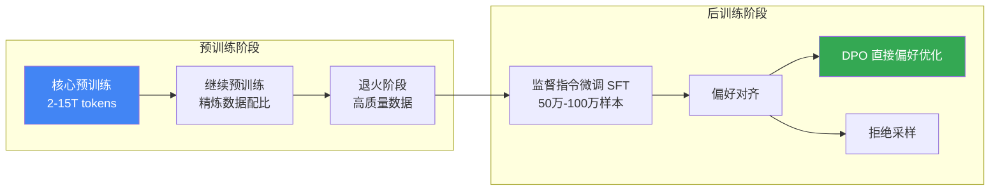

# New LLM Pre-training and Post-training Paradigms / LLM预训练与后训练新范式

> 📊 难度：⭐⭐⭐⭐ | ⏱️ 阅读：16分钟 | 📅 2024年8月17日 | 🏷️ 预训练, 后训练, DPO, RLHF, 知识蒸馏

> **原标题**: New LLM Pre-training and Post-training Paradigms
> **作者**: Sebastian Raschka
> **发布日期**: 2024年8月17日
> **原文链接**: https://magazine.sebastianraschka.com/p/new-llm-pre-training-and-post-training

## 📝 一句话摘要

通过深入对比 Qwen 2、Apple AFM、Gemma 2 和 Llama 3.1 四大模型的训练技术报告，揭示了2024年LLM训练领域的核心趋势：多阶段预训练成为标准范式，数据质量压倒数据数量，而后训练阶段正从复杂的RLHF向更简洁的DPO方向演进。

---

## 🔍 核心内容翻译

### 研究方法

Sebastian Raschka 选取了2024年四个最具代表性的大语言模型——阿里巴巴的Qwen 2、苹果的AFM、Google的Gemma 2和Meta的Llama 3.1，通过横向对比它们的技术报告，提炼出当代LLM训练的最新范式和趋势。

### 一、预训练阶段的新趋势

#### 1. 多阶段预训练

所有四个模型都采用了**多阶段预训练**策略，而非传统的单阶段训练：

- **核心预训练**：在大规模语料库（2-15万亿token）上进行基础训练
- **继续预训练**：使用精炼的数据配比和扩展上下文窗口
- **退火阶段**（Annealing）：在高质量数据集上进行最终优化

这种渐进式训练策略使模型能够先建立广泛的语言理解能力，再逐步提升特定领域的表现。

#### 2. 数据质量优先

Raschka 特别强调了一个关键发现：**"质量远比数量重要"**。所有团队都投入了大量精力进行数据清洗、去重和质量筛选，而非单纯追求更大的数据集。这是LLM训练理念的一个重要转变。

#### 3. 知识蒸馏

苹果和Google都采用了**知识蒸馏**（Knowledge Distillation）技术——用大型"教师模型"来训练小型"学生模型"。这使得高效的小型LLM（如Apple的3B参数设备端模型）能够在不按比例增加计算成本的情况下获得接近大模型的能力。

#### 4. 上下文窗口扩展

模型通过专门的训练阶段逐步扩展上下文窗口：从标准的4K token到32K甚至128K。这一过程使用合成数据来确保模型在处理超长文本时仍能保持高质量输出。

#### 5. 合成数据的广泛应用

多个模型生成合成的指令-回复对和问答内容来增强训练数据集。合成数据已经从"补充手段"上升为训练流程中的核心组成部分。

### 二、后训练阶段的方法论

#### 标准流程

后训练遵循一致的两阶段结构：

**第一阶段：监督指令微调（SFT）**
在50万至100万条人工标注的高质量示例上进行训练，教会模型按照人类期望的方式回答问题。这一阶段决定了模型的基本交互风格和指令遵循能力。

**第二阶段：偏好对齐**
使模型的输出更符合人类偏好，主要有两种方法：

#### DPO（直接偏好优化）

**DPO正在取代传统的RLHF成为主流**。它直接优化偏好差异，无需训练单独的奖励模型。Raschka 指出其"与其他方法相比具有易用性优势"。DPO 的核心思想是：与其先训练一个奖励模型来评估回答好坏，再用强化学习优化策略模型，不如直接用偏好数据来调整模型。

#### 拒绝采样（Rejection Sampling）

让模型为同一问题生成多个回答，由奖励模型选出最优回答用于进一步训练。这种方法在在线训练阶段特别有效。

#### 各模型的独特方法

- **Apple AFM**：引入了 iTeC（基于教师委员会的拒绝采样），结合多种偏好调优算法；还开发了 Mirror Descent Policy Optimization，被证明比标准PPO更有效
- **Gemma 2**：使用大于策略模型10倍的奖励模型进行RLHF
- **Llama 3.1**：有意选择更简单的 SFT + DPO 路线，放弃了复杂的RLHF策略
- **Qwen 2**：在预训练和后训练的各个阶段都广泛使用合成数据

#### 模型平均（Model Averaging）

Gemma 和 Llama 采用 WARP（加权平均奖励模型）来稳定训练性能，通过合并不同训练迭代的参数来避免过拟合和训练不稳定。

### 三、各模型亮点

| 模型 | 参数量 | 预训练数据 | 后训练策略 | 显著特点 |
|------|--------|------------|------------|----------|
| Qwen 2 | 多尺寸 | 大规模合成数据增强 | SFT + DPO | 151K词汇表，强多语言能力 |
| Apple AFM | 3B（设备端）| 三阶段预训练 | iTeC + MDPO | 知识蒸馏驱动的小型化 |
| Gemma 2 | 2B/9B/27B | 知识蒸馏（小型）| RLHF（大奖励模型）| 超大奖励模型策略 |
| Llama 3.1 | 多尺寸 | 15.6万亿token | SFT + DPO | 刻意回避架构创新 |

---

## 🔬 技术要点

1. **多阶段预训练已成标准**：单阶段预训练已被淘汰，分阶段训练（基础 -> 精炼 -> 退火）能更好地控制模型在不同能力维度上的表现。

2. **DPO 正在取代 RLHF**：行业正从复杂的基于PPO的强化学习转向更简洁、更稳定的直接偏好优化方法，降低了训练复杂度和计算成本。

3. **知识蒸馏成为小模型开发的关键**：大型教师模型训练小型学生模型的范式，使得设备端AI部署成为可能，Apple的3B模型就是典型案例。

4. **合成数据从补充变为核心**：所有顶尖团队都将合成数据生成作为训练流程的重要环节，特别是在上下文扩展和指令微调阶段。

5. **"质量优于数量"的数据哲学**：数据清洗和筛选的投入回报远高于单纯扩大数据规模，这一发现可能改变整个行业的数据策略。

---

## 🧠 深度解读

### 🟢 通俗版

Raschka 这篇文章的价值在于其独特的横向对比视角。通过同时分析四个顶尖模型的技术报告，他揭示了一些在单独阅读任何一篇报告时不易察觉的行业趋势。

### 🔴 深入版

最引人注目的发现是**简洁化趋势**。Meta在Llama 3.1中有意放弃了MoE（混合专家）和滑动窗口注意力等花哨的架构创新，转而将精力集中在数据质量和规模上。这传递了一个强烈的信号：在当前阶段，**数据工程可能比模型架构创新更重要**。

另一个深层趋势是**后训练复杂度的降低**。早期的ChatGPT使用复杂的PPO-based RLHF流程，而现在主流团队纷纷转向更简单的DPO。这并非技术倒退，而是对实践经验的务实总结——简单且有效的方法往往比理论上更优雅但实践中不稳定的方法更可取。

这篇文章也暗示了一个重要的行业格局变化：**LLM训练正从"英雄式创新"转向"工程化优化"**。当四个不同团队独立选择了相似的方法论时，说明行业已经越过了探索期，进入了工程最佳实践的收敛阶段。

---

## 💡 延伸思考

1. **小团队的机会在哪里？** 当训练范式趋于收敛时，资源有限的团队是否还有差异化竞争的空间？知识蒸馏和合成数据可能是关键杠杆。

2. **DPO是否是终点？** DPO解决了RLHF的许多工程难题，但它在理论上是否存在上限？未来是否会出现更先进的对齐方法？

3. **合成数据的边界**：当越来越多的模型用合成数据训练时，是否存在"模型近亲繁殖"的风险——即训练数据中AI生成内容的比例过高导致能力退化？

4. **数据质量的量化**：文章多次强调"质量比数量重要"，但如何量化和自动评估数据质量仍是一个开放问题。这可能催生新的数据评估工具和方法论。

---

*翻译整理日期：2026年3月21日*
