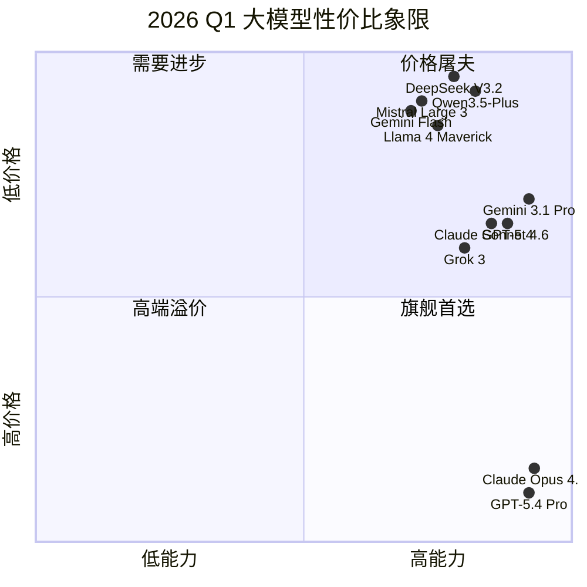
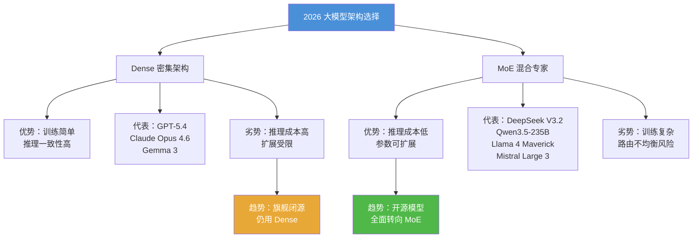

# 2026 Q1 大模型竞争格局全景横评

> **作者**: AI 前沿精读
> **发布日期**: 2026年3月27日
> **标签**: 横评 · 大模型 · Claude · GPT · Gemini · DeepSeek · Qwen · Mistral · 2026Q1

---

## 引言：Q1 的三件大事

2026 年第一季度，大模型战场发生了三个标志性事件：

1. **百万 token 平价化**——Anthropic 在 3 月宣布 Claude Opus 4.6 和 Sonnet 4.6 的 1M 上下文窗口**不再加价**，取消了此前 200K 以上的 2× 输入 / 1.5× 输出溢价。Google Gemini 3.1 Pro 同样提供 1M 上下文。百万级上下文从"旗舰特权"变成"行业标配"。
2. **GPT-5.4 统一推理与编码**——OpenAI 于 3 月发布 GPT-5.4，首次将推理链（chain-of-thought）、前沿编码能力和原生计算机使用（computer use）合并到同一个主线模型中，同时推出 Mini 和 Nano 免费变体，直接覆盖从免费用户到企业的全部层级。
3. **开源 MoE 全面逼近闭源**——DeepSeek V3.2-Speciale 在 IMO 2025 达到金牌水平，推理性能媲美 Gemini 3.0 Pro；Qwen3.5 以 9B 参数级实现接近 Sonnet 4.5 的表现；Mistral Large 3 以 $0.50/$1.50 的价格提供 262K 上下文的 MoE 模型。开源与闭源之间的差距从"代际"缩小到"百分点"。

**整体格局变化**：2025 年的竞争以"谁先出下一代"为主；2026 Q1 的主题已切换为"谁能用更低成本交付相同质量"，以及"推理模型 vs 通用模型"的路线之争。

---

## 一、性能矩阵：谁在领跑？

### 🟢 通俗版

想象大模型是参加全能运动会的选手。编码是短跑，推理是铁人三项，多模态是十项全能，长上下文是马拉松。没有一个选手全部第一，但有几位始终站在领奖台。

### 🔴 深入版

#### 1.1 编码能力对比

| 模型 | SWE-bench Verified | LiveCodeBench v6 | HumanEval | 备注 |
|------|-------------------|-------------------|-----------|------|
| Claude Opus 4.6 | **80.8%** | ~78% | 95.1% | 长代码库重构最强 |
| Claude Sonnet 4.6 | 79.6% | ~76% | 94.5% | 性价比编码之王 |
| GPT-5.4 | 57.7%* (Pro) | ~74% | 93.8% | *SWE-bench Pro 更严格 |
| GPT-5.4 Mini | 54.4%* (Pro) | ~70% | 91.2% | 免费用户可用 |
| Gemini 3.1 Pro | 80.6% | ~77% | 94.0% | 紧追 Claude |
| DeepSeek V3.2 Speciale | ~78%† | ~75% | 92.5% | 开源最强，†估计值 |
| Qwen3.5-Plus | ~77% | **83.6%** | 93.0% | LiveCodeBench 领跑 |
| Mistral Large 3 | ~65% | ~68% | 92.0% | 价格优势明显 |

> **注**：SWE-bench Verified 与 SWE-bench Pro 是不同难度的测试集，跨测试集的分数不可直接比较。标注 † 或 ~ 为基于公开信息的估计值。

**要点**：编码赛道形成 Claude Opus 4.6 / Gemini 3.1 Pro / DeepSeek V3.2 的三强格局，Qwen3.5-Plus 在 LiveCodeBench 上异军突起。

#### 1.2 推理能力对比

| 模型 | GPQA Diamond | AIME 2026 | MATH-500 | ARC-AGI | 备注 |
|------|-------------|-----------|----------|---------|------|
| Gemini 3.1 Pro | **94.3%** | ~95% | 98.5% | — | 学术推理之王 |
| Claude Opus 4.6 | 91.3% | ~90% | 97.8% | — | 科学问题第二 |
| GPT-5 | 81.0% | **100%** | **99.2%** | — | 数学完美分 |
| DeepSeek R1 | ~85% | 79.8%* | 97.3% | — | *AIME 2024 数据 |
| Qwen3.5-Plus | 88.4% | ~88% | 97.0% | — | 开源推理新高 |
| Claude Sonnet 4.6 | 74.1% | ~75% | 93.5% | — | 与 Opus 差距明显 |
| Grok 3 | ~80% | ~82% | 95.0% | — | Colossus 10× 算力 |

**要点**：推理赛道分化严重——Gemini 3.1 Pro 在 GPQA（PhD 级科学）领先，GPT-5 在高中数学 (AIME) 拿到完美分，Claude Opus 4.6 综合推理稳居前三。

#### 1.3 多模态能力对比

| 模型 | 图像理解 | 视频理解 | 音频理解 | 文档/PDF | 备注 |
|------|---------|---------|---------|---------|------|
| GPT-5.4 | ✅ 原生 | ✅ | ✅ | ✅ | 全模态统一 |
| Gemini 3.1 Pro | ✅ 原生 | ✅ | ✅ | ✅ | 四模态最均衡 |
| Claude Opus 4.6 | ✅ | ❌ | ❌ | ✅ | 仅图像+文档 |
| Qwen3.5 | ✅ 原生 | ✅ | ✅ | ✅ | 开源多模态最强 |
| Llama 4 Maverick | ✅ | ❌ | ❌ | ✅ | 图像+文本 |

**要点**：多模态赛道 GPT-5.4 和 Gemini 3.1 Pro 并驾齐驱，Qwen3.5 是开源阵营唯一的四模态选手。Claude 在视频和音频上仍有明显短板。

#### 1.4 长上下文能力对比

| 模型 | 标称窗口 | 实测可靠范围 | MRCR v2 (256K) | 备注 |
|------|---------|------------|----------------|------|
| Llama 4 Scout | **10M** | ~2M | — | 最长窗口 |
| GPT-5.4 | 922K+128K | ~800K | — | 输入输出分离 |
| Claude Opus 4.6 | 1M | ~800K | **93%** | 长上下文最可靠 |
| Gemini 3.1 Pro | 1M | ~700K | ~85% | 深度检索稍弱 |
| Claude Sonnet 4.6 | 1M (beta) | ~500K | ~70% | 比 Opus 衰减更快 |
| DeepSeek V3.2 | 128K | ~100K | — | 窗口相对小 |
| Qwen3.5 | 128K | ~100K | — | 同上 |

**要点**：1M 上下文已成旗舰标配。Claude Opus 4.6 在 MRCR v2 上 93% 的得分表明其在超长文档中保持检索可靠性的能力显著领先（Sonnet 4.5 的 4-9 倍）。

#### 综合能力雷达图

```mermaid
%%{init: {'theme': 'base', 'themeVariables': {'primaryColor': '#4A90D9'}}}%%
radar
    title 2026 Q1 旗舰模型综合能力
    axis Coding, Reasoning, Multimodal, Long Context, Speed, Price
    "Claude Opus 4.6" : [95, 92, 60, 95, 60, 40]
    "GPT-5.4" : [85, 90, 95, 88, 75, 70]
    "Gemini 3.1 Pro" : [93, 95, 95, 85, 70, 75]
    "DeepSeek V3.2" : [80, 85, 50, 50, 80, 98]
    "Qwen3.5-Plus" : [85, 88, 85, 50, 75, 95]
```

> **阅读说明**：每个维度 0-100 分，Price 维度得分越高代表越便宜。Speed 基于 tokens/sec 输出速度。数据综合多个公开基准，带有主观判断成分。

---

## 二、定价战争：成本如何重塑市场

### 🟢 通俗版

如果 2024 年大模型 API 的价格像星巴克，那 2026 Q1 部分模型的价格已经是瑞幸——甚至拼多多。DeepSeek V3.2 处理 100 万字输入只要约 2 毛钱人民币；而 Claude Opus 4.6 处理同样内容需要约 35 元。差距高达 **175 倍**，但它们并不是在做同一件事。

### 🔴 深入版

#### 2.1 旗舰模型 API 定价表（截至 2026 年 3 月）

| 模型 | 输入 ($/1M tokens) | 输出 ($/1M tokens) | 上下文窗口 | 批量折扣 |
|------|-------------------|-------------------|-----------|---------|
| **Claude Opus 4.6** | $15.00 | $75.00 | 1M | 50% (batch) |
| **Claude Sonnet 4.6** | $3.00 | $15.00 | 1M (beta) | 50% (batch) |
| Claude Haiku 4.5 | $0.25 | $1.25 | 200K | 50% (batch) |
| **GPT-5.4** | $2.50 | $15.00 | 922K | 50% (batch) |
| GPT-5.4 Pro | $15.00 | $90.00 | 922K | — |
| GPT-5.4 Mini | 免费 / $0.25* | $1.00* | 128K | — |
| **Gemini 3.1 Pro** | $2.00 | $12.00 | 1M | — |
| Gemini 3 Flash | $0.50 | $3.00 | 1M | — |
| Gemini 3.1 Flash-Lite | $0.25 | $1.50 | 1M | — |
| **DeepSeek V3.2** | $0.28 | $0.42 | 128K | 90% (cache) |
| DeepSeek R1 | $0.55 | $2.19 | 128K | — |
| **Qwen3.5-Plus** | ~$0.50 | ~$2.00 | 128K | — |
| **Mistral Large 3** | $0.50 | $1.50 | 262K | — |
| Codestral | $0.20 | $0.60 | 256K | — |
| **Grok 3** | $3.00 | $15.00 | 1M | — |

> *GPT-5.4 Mini 对 ChatGPT Free 用户免费使用，API 价格约 $0.25/$1.00。

#### 2.2 DeepSeek 的价格冲击

DeepSeek V3.2 的 $0.28 输入 / $0.42 输出定价，是 Claude Opus 4.6 的 **1/54（输入）** 和 **1/179（输出）**。这个价格优势来自三个技术因素：

- **MoE 架构效率**：671B 总参数中每次推理仅激活 37B，推理计算量远低于同等质量的 Dense 模型
- **DeepSeek Sparse Attention**：自研稀疏注意力机制，在长上下文场景下降低计算复杂度
- **中国算力成本**：国内 GPU 集群运营成本约为美国的 40-60%

但便宜有代价：128K 的上下文窗口远小于旗舰模型的 1M，且多模态能力有限。

#### 2.3 免费/开源 vs 闭源商业

| 维度 | 闭源旗舰 | 开源/开放权重 | 免费 API |
|------|---------|-------------|---------|
| 典型代表 | Opus 4.6, GPT-5.4 Pro | Llama 4, DeepSeek V3.2, Qwen3.5 | GPT-5.4 Mini (Free), Gemini Flash-Lite |
| 适用场景 | 关键业务、安全审计、科研 | 自部署、定制化微调、数据隐私 | 原型开发、个人项目、教育 |
| 成本 | $15-75/1M tokens | 硬件成本（自部署）或 $0.2-2/1M | $0 |
| 灵活性 | API 受限 | 完全可控 | 有速率限制 |

#### 性价比象限图



> **阅读说明**：右上角是"高能力 + 低价格"的理想位置（旗舰首选）。Gemini 3.1 Pro 在能力和价格之间取得了最佳平衡，DeepSeek/Qwen 凭借超低价占据"价格屠夫"象限。

---

## 三、技术路线分野

### 🟢 通俗版

现在的大模型发展，像一条河在山口分成了四条支流：闭源巨头走"全能旗舰"路线，开源生态走"共建共享"路线，推理专用模型走"深度思考"路线，架构之争则是"密集"还是"稀疏"（MoE）。每条路线都有赢家，没有哪条路一定更好。

### 🔴 深入版

#### 3.1 闭源巨头：Anthropic / OpenAI / Google

三家闭源巨头的技术方向已经明显分化：

| 公司 | 核心优势 | 独特能力 | 2026 Q1 关键动作 |
|------|---------|---------|----------------|
| **Anthropic** | 安全对齐 + 编码 Agent | Compaction API（无限对话）、Agent Teams、宪法 AI | 1M 上下文平价化、Claude Code 生态 |
| **OpenAI** | 全栈产品 + 多模态 | 原生 Computer Use、Codex 集成、超级应用整合 | GPT-5.4 统一模型、Mini/Nano 免费化 |
| **Google** | 学术推理 + 基础设施 | Deep Think（多流并行推理）、1M 上下文、全模态 | Gemini 3.1 Pro GPQA 94.3% 领先 |

#### 3.2 开源生态：Meta / DeepSeek / Qwen / Mistral

| 项目 | 架构 | 参数量 | 许可证 | 亮点 |
|------|------|-------|--------|------|
| Llama 4 Maverick | MoE (128 experts) | 17B active / ~400B total | Llama License | 10M 上下文 (Scout) |
| DeepSeek V3.2 | MoE | 37B active / 671B total | MIT | 价格极低，IMO 金牌 |
| Qwen3.5 | Gated Delta + MoE | 0.8B-235B | Apache 2.0 | 201 种语言，四模态 |
| Mistral Large 3 | MoE | ~24B active | Apache 2.0 | 欧洲主权 AI |
| Gemma 3 | Dense | 1B-27B | Gemma License | Google 开源分支 |

**趋势判断**：开源模型在 2026 Q1 集体采用 MoE 架构，通过"大参数+少激活"实现更好的性价比。Dense（全参数激活）架构在大模型中正逐渐成为少数派。

#### 3.3 推理专用模型

推理专用模型（reasoning models）已成为一个独立品类：

- **OpenAI o-series (o3, o4-mini)**：最早的推理专用系列，通过显式思维链实现深度推理
- **DeepSeek R1**：开源推理模型标杆，MIT 许可，AIME 2024 达 79.8%
- **Gemini Deep Think**：多流并行推理，可在多条思路之间切换探索
- **Claude Extended Thinking**：自适应推理深度，effort 级别可调（low/medium/high/max）
- **Qwen3 Thinking Mode**：混合模式，同一模型可在 thinking / non-thinking 间切换

**关键分歧**：推理模型是应该独立存在（o-series 路线），还是融入通用模型（GPT-5.4 / Claude Sonnet 4.6 路线）？2026 Q1 的趋势倾向后者——GPT-5.4 首次将推理能力内置到主线模型。

#### 3.4 MoE vs Dense 架构选择



> **补充说明**：GPT-5.4 和 Claude Opus 4.6 是否使用 MoE，Anthropic 和 OpenAI 均未公开确认。上图基于公开信息和推测——如果它们是 MoE 但未公开，则闭源/开源的架构差异更多在于"是否公开架构细节"而非"是否使用 MoE"。

---

## 四、生态与工具

### 🟢 通俗版

大模型不只是聊天机器人——它们正在成为"数字员工"，能操作电脑、写代码、管理工具。哪家的"工具箱"最丰富、最好用，决定了开发者选谁。

### 🔴 深入版

#### 4.1 Agent / Tool Use 能力对比

| 能力 | Claude | GPT-5.4 | Gemini 3.1 | DeepSeek | Qwen |
|------|--------|---------|------------|----------|------|
| Function Calling | ✅ 成熟 | ✅ 成熟 | ✅ 成熟 | ✅ V3.1 改进 | ✅ 原生 MCP |
| Computer Use | ✅ Cowork | ✅ 原生 | ✅ 专用模型 | ❌ | ❌ |
| Multi-Agent | ✅ Agent Teams | ✅ Codex | ⚠️ 有限 | ❌ | ❌ |
| MCP 支持 | ✅ 原生 | ⚠️ 第三方 | ⚠️ 第三方 | ❌ | ✅ 原生 |
| 长时间任务 | ✅ Long-running | ✅ Background | ⚠️ 有限 | ❌ | ❌ |
| 自适应推理 | ✅ Effort 可调 | ✅ Pro 模式 | ✅ Deep Think | ❌ | ✅ Thinking Mode |

**要点**：Agent 能力是 2026 年闭源模型最大的护城河。Claude 和 GPT-5.4 在 computer use、multi-agent、long-running tasks 上遥遥领先。Qwen 是开源阵营中 Agent 能力最强的（原生 MCP + function calling）。

#### 4.2 IDE 集成：AI 编程三巨头

| 工具 | 底层模型 | 核心能力 | 价格 | 独特优势 |
|------|---------|---------|------|---------|
| **Claude Code** | Claude Opus/Sonnet 4.6 | 终端原生、Agent 模式、多文件编辑 | Max $100/月 含 | 1M 上下文读全仓库 |
| **Cursor** | 多模型（Claude/GPT） | IDE 内嵌、Tab 补全、Agent 模式 | $20/月 起 | 开发者体验最流畅 |
| **GitHub Copilot + Codex** | GPT-5.4 | 后台异步执行、PR 生成、测试编写 | $10/月 起 | GitHub 生态深度集成 |
| **Kimi Code CLI** | Kimi K2.5 | 终端原生、中文优化 | 免费 | 中文代码理解 |

#### 4.3 API 生态成熟度

| 维度 | Anthropic | OpenAI | Google | DeepSeek | 阿里云 |
|------|-----------|--------|--------|----------|-------|
| SDK 语言数 | 5+ | 10+ | 8+ | 3 | 5+ |
| Prompt Caching | ✅ 90% 折扣 | ✅ 50% 折扣 | ✅ | ✅ 90% 折扣 | ✅ |
| Batch API | ✅ 50% 折扣 | ✅ 50% 折扣 | ✅ | ✅ | ✅ |
| Streaming | ✅ | ✅ | ✅ | ✅ | ✅ |
| Structured Output | ✅ | ✅ JSON Schema | ✅ | ✅ | ✅ |
| 地域覆盖 | 全球 | 全球 | 全球 | 全球 | 中国优先 |
| 企业 SLA | ✅ | ✅ | ✅ | ⚠️ 有限 | ✅ |

---

## 五、中国市场特别观察

### 🟢 通俗版

中国大模型市场有自己的"平行宇宙"——全球排名和国内排名可能完全不同。DeepSeek 靠价格，Qwen 靠生态，Kimi 靠产品。三家各有一把刷子。

### 🔴 深入版

#### 5.1 DeepSeek / Qwen / Kimi 三足鼎立

| 维度 | DeepSeek | Qwen (阿里) | Kimi (月之暗面) |
|------|----------|------------|---------------|
| **核心优势** | 推理 + 极致性价比 | 多语言 + 阿里云生态 | 产品体验 + 端到端 RL |
| **最新模型** | V3.2 Speciale, V4 Lite | Qwen3.5, Qwen3-Coder | K2.5 多模态 |
| **开源策略** | MIT 许可，完全开放 | Apache 2.0，完全开放 | 不开源核心模型 |
| **定价策略** | 全球最低价 | 中等偏低 | 免费产品 + 付费 API |
| **目标用户** | 开发者、自部署 | 企业客户、全球化 | C 端用户、研究者 |
| **Agent 能力** | ⚠️ 弱 | ✅ MCP + 工具调用 | ✅ Researcher + Code CLI |
| **2026 Q1 亮点** | V4 Lite 发布 | Qwen3.5 Small 系列 | K2.5 API 平台 |

#### 5.2 政策影响

- **算力管控**：美国对华 AI 芯片出口限制持续升级，但中国企业通过架构创新（MoE 稀疏激活）和国产芯片（华为昇腾）部分缓解了影响
- **数据合规**：《生成式 AI 服务管理暂行办法》要求模型备案，进一步拉开国内外市场的差距
- **开源政策**：中国政府鼓励开源，DeepSeek 和 Qwen 的开源策略符合政策导向

#### 5.3 应用场景差异

| 场景 | 海外首选 | 国内首选 | 原因 |
|------|---------|---------|------|
| 企业客服 | GPT-5.4 / Claude | Qwen / Kimi | 中文理解 + 合规 |
| 代码生成 | Claude Code / Copilot | Qwen3-Coder / Kimi Code | 本地化 + 成本 |
| 学术研究 | Gemini / Claude | DeepSeek R1 | 开源可复现 |
| 金融分析 | Claude / GPT | Kimi / DeepSeek | 中文财报理解 |
| 教育辅导 | GPT / Gemini | Qwen / Kimi | 政策合规 + 免费 |

#### 其他值得关注的中国模型

- **MiniMax M2.5**：SWE-bench Verified 达 80.2%，以 1/20 成本匹敌前沿模型
- **智谱 GLM-5**：SWE-bench 76-78%，Agent 原生设计
- **百川 Baichuan-M3**：医疗 AI 垂直领域突破

---

## 六、预测：Q2 展望

### 关键看点

1. **Anthropic Claude 5?**——Anthropic 通常每 6-8 个月发布新代际。Claude 4 系列始于 2025 年中，Claude 5 可能在 2026 Q2-Q3 亮相。如果 Claude 5 在多模态上补齐短板（视频、音频），将直接挑战 GPT 和 Gemini 的全模态优势。

2. **Llama 4 Behemoth 正式发布**——Meta 的旗舰教师模型仍在训练中，一旦开源将重塑开源模型的天花板。预计 2026 年中发布。

3. **推理成本进一步下降**——随着 MoE 架构和稀疏注意力技术成熟，旗舰模型的推理成本可能在 Q2 再下降 30-50%。Google 的 Flash-Lite 系列已经展示了这一方向。

4. **Agent 从 Demo 到 Production**——2025 年是 Agent 的"概念年"，2026 年是"落地年"。Claude Code、GitHub Copilot Codex、Kimi Code CLI 的竞争将决定 AI 编程市场的格局。

5. **端侧模型爆发**——Qwen3.5 Small（0.8B-9B）、GPT-5.4 Nano、Gemma 3 等小模型将推动 AI 从云端向终端迁移。

### 可能的格局变化

```
当前格局（Q1）           可能的 Q2 格局
───────────          ──────────────
旗舰三强固定           旗舰四强？(+DeepSeek V4)
开源追赶闭源           开源在特定任务超越闭源
推理模型独立品类        推理能力内置成标配
百万 token 是溢价       百万 token 是标配
Agent 是新鲜事物        Agent 是基础能力
```

---

## 附录

### A. 完整 Benchmark 数据表

| 模型 | SWE-bench V. | GPQA Diamond | AIME 2026 | MATH-500 | LiveCodeBench v6 | HumanEval | MMLU | OSWorld | 上下文 | 发布日期 |
|------|-------------|-------------|-----------|----------|------------------|-----------|------|---------|--------|---------|
| Claude Opus 4.6 | 80.8% | 91.3% | ~90% | 97.8% | ~78% | 95.1% | ~92% | 76% | 1M | 2026.03 |
| Claude Sonnet 4.6 | 79.6% | 74.1% | ~75% | 93.5% | ~76% | 94.5% | ~90% | 72.5% | 1M | 2026.02 |
| GPT-5.4 | 57.7%* | ~82% | ~95% | 98.0% | ~74% | 93.8% | ~93% | 75.0% | 922K | 2026.03 |
| GPT-5.4 Pro | — | ~88% | ~98% | 99.0% | — | — | ~94% | — | 922K | 2026.03 |
| Gemini 3.1 Pro | 80.6% | 94.3% | ~95% | 98.5% | ~77% | 94.0% | ~93% | — | 1M | 2026.02 |
| Gemini 3 Flash | ~60% | ~70% | ~65% | 88.0% | ~55% | 88.0% | ~85% | — | 1M | 2025.12 |
| DeepSeek V3.2 Sp. | ~78% | ~85% | ~88% | 97.3% | ~75% | 92.5% | ~90% | — | 128K | 2025.12 |
| DeepSeek R1 | — | ~85% | 79.8%† | 97.3% | — | — | ~88% | — | 128K | 2025.01 |
| Qwen3.5-Plus | ~77% | 88.4% | ~88% | 97.0% | 83.6% | 93.0% | ~91% | — | 128K | 2026.02 |
| Llama 4 Maverick | ~65% | ~72% | ~70% | 90.0% | ~60% | 89.0% | ~86% | — | 1M | 2025.04 |
| Mistral Large 3 | ~65% | ~75% | ~70% | 90.0% | ~68% | 92.0% | 85.5% | — | 262K | 2025.11 |
| Grok 3 | ~70% | ~80% | ~82% | 95.0% | ~68% | 91.0% | ~88% | — | 1M | 2025.06 |

> **注释**：标注 ~ 为基于多源信息的估计值，† 为使用旧版测试集的数据，* 为 SWE-bench Pro（更严格）而非 SWE-bench Verified。各模型的测试条件（采样次数、prompt 工程等）可能不同，跨模型对比需谨慎。

### B. 完整定价对比表

| 模型 | 输入 ($/1M) | 输出 ($/1M) | 缓存输入 ($/1M) | 批量输入 ($/1M) | 上下文 |
|------|-----------|-----------|---------------|---------------|--------|
| Claude Opus 4.6 | $15.00 | $75.00 | $1.50 | $7.50 | 1M |
| Claude Sonnet 4.6 | $3.00 | $15.00 | $0.30 | $1.50 | 1M |
| Claude Haiku 4.5 | $0.25 | $1.25 | $0.025 | $0.125 | 200K |
| GPT-5.4 | $2.50 | $15.00 | — | $1.25 | 922K |
| GPT-5.4 Pro | $15.00 | $90.00 | — | — | 922K |
| GPT-5.4 Mini | $0.25 | $1.00 | — | $0.125 | 128K |
| GPT-5.4 Nano | — | — | — | — | 64K |
| Gemini 3.1 Pro | $2.00 | $12.00 | — | — | 1M |
| Gemini 3 Flash | $0.50 | $3.00 | — | — | 1M |
| Gemini 3.1 Flash-Lite | $0.25 | $1.50 | — | — | 1M |
| DeepSeek V3.2 | $0.28 | $0.42 | $0.028 | — | 128K |
| DeepSeek R1 | $0.55 | $2.19 | — | — | 128K |
| Qwen3.5-Plus | ~$0.50 | ~$2.00 | — | — | 128K |
| Mistral Large 3 | $0.50 | $1.50 | — | — | 262K |
| Codestral | $0.20 | $0.60 | — | — | 256K |
| Grok 3 | $3.00 | $15.00 | — | — | 1M |

### C. 术语表

| 术语 | 含义 |
|------|------|
| MoE | Mixture of Experts，混合专家架构，每次推理仅激活部分参数 |
| Dense | 密集架构，每次推理激活全部参数 |
| SWE-bench | 软件工程基准测试，测试模型解决 GitHub Issue 的能力 |
| GPQA | Graduate-level PhD Questions & Answers，博士级科学问答 |
| AIME | 美国邀请赛数学考试，衡量高中竞赛数学能力 |
| MRCR | Multi-turn Retrieval in Context Recall，长上下文检索可靠性 |
| MCP | Model Context Protocol，模型上下文协议（Anthropic 发起） |
| Extended Thinking | 扩展思考，模型在回答前进行内部推理的能力 |
| Computer Use | 计算机使用，模型直接操作鼠标键盘的能力 |
| Compaction API | 上下文压缩 API，自动摘要旧对话以支持无限长对话 |

---

> **数据来源**：本文数据综合自各公司官方发布、Artificial Analysis、LLM Stats、BenchLM、PricePerToken 等第三方评测平台，以及 VentureBeat、The New Stack、DeepLearning.AI 等媒体报道。标注估计值（~）的数据基于多源交叉验证，但可能与官方数据存在偏差。
>
> **免责声明**：AI 领域变化极快，本文数据截至 2026 年 3 月 27 日。部分模型可能在发布后持续更新，实际表现可能与本文记录有差异。
>
> **参考链接**：
> - [Anthropic Claude 定价页](https://platform.claude.com/docs/en/about-claude/pricing)
> - [OpenAI GPT-5.4 发布公告](https://openai.com/index/introducing-gpt-5-4/)
> - [Google Gemini 2.5 / 3 系列](https://deepmind.google/en/models/gemini/pro/)
> - [DeepSeek 模型文档](https://api-docs.deepseek.com/)
> - [Qwen3.5 GitHub](https://github.com/QwenLM/Qwen3.5)
> - [Mistral AI 模型定价](https://pricepertoken.com/pricing-page/provider/mistral-ai)
> - [BenchLM 全模型对比](https://benchlm.ai/)
> - [Artificial Analysis 模型排名](https://artificialanalysis.ai/)
