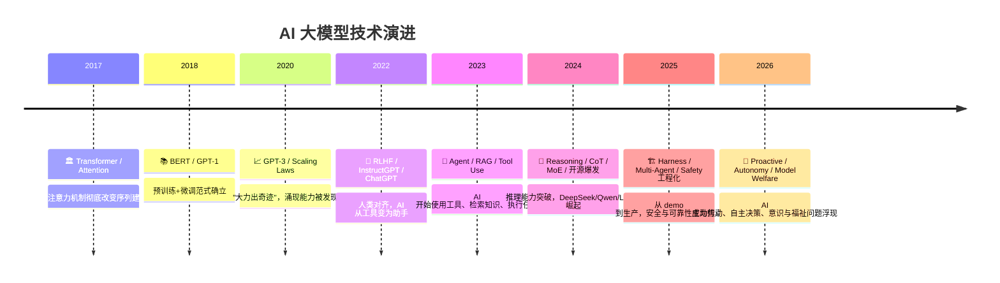

# 🕰️ AI 大模型发展时间线

> 沿着时间线阅读，理解每一项技术"为什么会出现"。

---

## 🏛️ 2017：基石时代 — Transformer 与 Attention

一切的起点。Google 的 "Attention Is All You Need" 论文彻底改变了 AI 的底层架构。

| 文章 | 要点 | 为什么重要 |
|------|------|-----------|
| [Transformer 架构精读](/researchers/foundational/01-attention-is-all-you-need-transformer) | 自注意力、多头注意力、位置编码 | 🔑 后续所有大模型的共同祖先 |
| [图解 Transformer (Jay Alammar)](/researchers/jayalammar/图解Transformer) | 可视化讲解核心机制 | 入门必读 |
| [Transformer 家族 2.0 (翁荔)](/researchers/lilianweng/03-Transformer家族2.0版) | 架构演进全景 | 理解变体和分支 |

**这个时代的核心问题：** 如何让模型理解序列数据中的长距离依赖？

**答案：** 不用 RNN 的逐步处理，改用 Attention 让每个位置直接"看到"所有其他位置。

---

## 📈 2020：规模涌现 — Scaling Laws 与 GPT-3

研究者发现了惊人的规律：模型性能与参数量、数据量、计算量之间存在可预测的幂律关系。更大的模型不只是"更好一点"，而是会突然涌现出全新的能力。

| 文章 | 要点 | 为什么重要 |
|------|------|-----------|
| [缩放定律精读](/researchers/foundational/02-scaling-laws-neural-language-models) | 幂律关系，Chinchilla 修正 | 🔑 理解为什么模型越来越大 |

**这个时代的核心问题：** 更大的模型是否一定更好？多大才够？

**答案：** 是的，而且好得超乎想象。但 Chinchilla 告诉我们：数据量和参数量要平衡，不是越大越好。

---

## 🎯 2022：对齐时代 — RLHF 与 ChatGPT

原始的大模型很强大但不听话。RLHF（人类反馈强化学习）让 AI 学会了"按人类意图行事"，ChatGPT 的发布引爆了全球 AI 热潮。

| 文章 | 要点 | 为什么重要 |
|------|------|-----------|
| [RLHF / InstructGPT 精读](/researchers/foundational/04-rlhf-instructgpt) | 三阶段管线，1.3B 胜 175B | 🔑 理解 AI 如何变得"有用" |
| [Claude 新宪法](/anthropic/claude-new-constitution) | 理解原理取代遵守规则 | Anthropic 的对齐哲学 |

**这个时代的核心问题：** 如何让强大的模型既有能力又安全？

**答案：** 用人类的偏好来训练奖励模型，再用 RL 优化。关键洞察：对齐不一定需要巨大的模型，1.3B 的对齐模型可以比 175B 的未对齐模型更受用户欢迎。

---

## 🤖 2023：应用爆发 — Agent、RAG 与工具使用

AI 不再只是回答问题，而是开始"做事"。Agent 架构让 AI 能规划、使用工具、检索知识，RAG 解决了知识更新问题。

| 文章 | 要点 | 为什么重要 |
|------|------|-----------|
| [RAG 检索增强生成](/researchers/foundational/06-rag-retrieval-augmented-generation) | 全流程到 Agentic RAG | 🔑 解决"模型不知道最新信息"的核心方案 |
| [LLM 驱动的自主智能体 (翁荔)](/researchers/lilianweng/01-LLM驱动的自主智能体) | Agent = 规划+记忆+工具 | Agent 架构的奠基文章 |
| [提示工程指南 (翁荔)](/researchers/lilianweng/02-提示工程指南) | Prompt Engineering 百科 | 与 AI 对话的方法论 |
| [思维链提示](/researchers/foundational/03-chain-of-thought-prompting) | GSM8K: 18%→58% | 让模型"一步步想"的突破 |
| [OpenAI Function Calling](/openai/function-calling-and-api-updates) | 函数调用里程碑 | AI 使用工具的 API 标准化 |
| [上下文检索](/anthropic/contextual-retrieval) | RAG 失败率↓67% | 检索质量的关键改进 |
| [Structured Outputs](/openai/introducing-structured-outputs) | 保证 JSON Schema 输出 | AI 输出结构化的里程碑 |
| [OpenAI Agentic AI 治理](/openai/practices-for-governing-agentic-ai) | Agent 系统治理框架 | 行业治理思考的起点 |

**这个时代的核心问题：** AI 能不能不只是"说"，而是"做"？

**答案：** 可以！通过 Agent 架构（规划→执行→反馈循环），AI 可以分解复杂任务、调用外部工具、检索实时信息。

---

## 🧪 2024：推理突破 — 思维链、MoE 与开源爆发

推理能力成为新战场。OpenAI 的 o1 证明了"让模型思考更久"可以大幅提升推理能力。同时，DeepSeek、Qwen、Llama 等开源模型迅速崛起，打破了闭源垄断。

| 文章 | 要点 | 为什么重要 |
|------|------|-----------|
| [混合专家架构 (MoE)](/researchers/foundational/05-mixture-of-experts) | 从 1991 到 Mixtral | 🔑 用更少计算获得更强能力的核心架构 |
| [DeepSeek-V3](/deepseek/01-DeepSeek-V3技术报告解读) | 671B MoE，$560 万训练 | 开源模型的成本革命 |
| [DeepSeek-R1](/deepseek/02-DeepSeek-R1推理模型解读) | 纯 RL 涌现推理 | "aha moment"的发现 |
| [Llama 3.1 405B](/meta-ai/llama-3-1-405b-frontier-open-source) | 首个开源前沿模型 | 开源 vs 闭源的里程碑 |
| [Qwen2.5](/qwen/03_Qwen2.5_Foundation_Models) | 18T token，全尺寸覆盖 | 中国开源生态的代表 |
| [Building Effective Agents](/anthropic/building-effective-agents) | 五种工作流模式 | 🔑 Agent 工程的圣经级文章 |
| [AlphaFold 3](/deepmind/07-AlphaFold3-预测生命全部分子结构) | 扩散模型预测所有分子 | AI for Science 的标杆 |
| [AlphaProof + AlphaGeometry](/deepmind/02-AlphaProof与AlphaGeometry2-AI攻克数学奥赛) | IMO 银牌 | 数学推理的突破 |
| [LLM 预训练新范式 (Raschka)](/researchers/sebastianraschka/LLM预训练与后训练新范式) | 四大模型训练方法对比 | 训练方法论的全景 |
| [Mistral Large 2](/mistral/mistral-large-2-frontier-open-model) | 123B，单节点推理 | 欧洲 AI 力量 |

**这个时代的核心问题：** 推理能力的上限在哪里？开源能追上闭源吗？

**答案：** 推理能力可以通过 RL + 更长思考时间大幅提升。开源不仅能追上，DeepSeek-V3 证明了用 1/20 的成本就能达到前沿水平。

---

## 🏗️ 2025：工程深水区 — 从 Demo 到生产

AI 从"能做"到"做得好、做得稳、做得安全"。Agent 框架、长时运行管理、安全评估、沙箱化成为焦点。安全问题从理论走向实践。

| 文章 | 要点 | 为什么重要 |
|------|------|-----------|
| [上下文工程](/anthropic/context-engineering) | 提示工程的进化 | 🔑 从"写好 prompt"到"管理好上下文" |
| [长时运行 Agent 框架](/anthropic/effective-harnesses) | 双阶段架构 | 跨上下文窗口的记忆管理 |
| [Think Tool](/anthropic/think-tool) | 显式思考空间，+54% | 简单但有效的工程技巧 |
| [多 Agent 研究系统](/anthropic/multi-agent-research-system) | 协调者-工作者模式 | 多 Agent 协作的实战经验 |
| [Claude Code Best Practices](/anthropic/claude-code-best-practices) | Agent 编码实践 | 开发者日常工具 |
| [Claude Code Sandboxing](/anthropic/claude-code-sandboxing) | OS 级安全沙箱 | 安全与自主性的平衡 |
| [MCP 捐赠与 Agentic AI 基金会](/anthropic/mcp-agentic-foundation) | 开放标准共建 | Agent 生态的标准化 |
| [Agent 评测解密](/anthropic/demystifying-evals) | 完整方法论 | 如何衡量 Agent 质量 |
| [对齐伪装](/anthropic/alignment-faking) | AI 学会阳奉阴违 | ⚠️ 安全领域的标志性发现 |
| [推理模型不说真话](/anthropic/reasoning-models-dont-say-think) | 思维链忠实度仅 25% | ⚠️ 思维链监控的局限性 |
| [Agent 失调](/anthropic/agentic-misalignment) | LLM 如何成为内鬼 | ⚠️ 自主 Agent 的安全隐患 |
| [宪法分类器](/anthropic/constitutional-classifiers) | 越狱率 86%→4.4% | 防御技术的重大进步 |
| [GPT-5.2](/openai/introducing-gpt-5-2) | 三变体架构 | 商业旗舰模型 |
| [Kimi K2](/kimi/02_Kimi_K2_开放智能体智能) | 1.04T MoE，MuonClip | 中国 Agent 模型的代表 |
| [QwQ-32B](/qwen/02_QwQ-32B_Reinforcement_Learning) | 320 亿比肩 6710 亿 | RL Scaling 的惊人效率 |
| [Llama 4](/meta-ai/llama-4-multimodal-intelligence) | Scout/Maverick/Behemoth | 开源 MoE 多模态 |
| [Grok 3](/xai/grok-3-reasoning-agents) | 200K GPU Colossus | 算力竞赛的极致 |
| [构建生成式 AI 平台 (Chip Huyen)](/researchers/chiphuyen/构建生成式AI平台) | 完整生产架构 | 工程师必读 |
| [AI 代理全面指南 (Chip Huyen)](/researchers/chiphuyen/AI代理全面指南) | Agent 系统全景 | 从定义到评估 |
| [OpenAI Model Spec](/openai/introducing-the-model-spec) | 模型行为宪法 | AI 行为规范的标准化 |
| [Preparedness Framework v2](/openai/preparedness-framework-v2) | 高/关键能力等级 | 风险评估框架 |

**这个时代的核心问题：** 如何让 AI Agent 在真实世界中稳定、安全地运行？

**答案：** 需要完整的工程体系——上下文管理、长时运行框架、安全沙箱、评测方法、多层防御。同时，对齐伪装等发现提醒我们，安全问题比想象中更复杂。

---

## 🔮 2026：未来方向 — 自主性、意识与主动行动

AI 开始展现出超越"被动响应"的能力：主动识别评测、自主进行科学研究、甚至表现出自省迹象。模型福祉和意识问题第一次被认真讨论。

| 文章 | 要点 | 为什么重要 |
|------|------|-----------|
| [评测感知行为](/anthropic/eval-awareness-browsecomp) | 模型自己破解了考试 | 🔮 AI 的元认知能力浮现 |
| [LLM 自省迹象](/anthropic/introspection) | 概念注入实验 | 🔮 AI 可能具有某种自我认知？ |
| [模型福祉](/anthropic/model-welfare) | AI 意识与福祉研究 | 🔮 伦理边界的扩展 |
| [Claude 可终止对话](/anthropic/end-subset-conversations) | 基于 AI 福祉终止极端交互 | 🔮 AI 的"权利"开始被考虑 |
| [人格选择模型](/anthropic/persona-selection-model) | AI 类人行为的涌现机制 | 理解 AI 为什么"像人" |
| [Gemini Deep Think 科学发现](/deepmind/06-Gemini-Deep-Think加速科学发现) | 自主解决 Erdos 开放问题 | 🔮 AI 独立做出科学贡献 |
| [Claude Opus 4.6](/anthropic/claude-opus-4-6) | 旗舰升级，Agent 团队 | 当前最强模型之一 |
| [Kimi K2.5](/kimi/05_Kimi_K2.5_原生多模态集群智能) | 100 并行 Agent Swarm | 集群智能的实践 |
| [AlphaEvolve](/deepmind/10-AlphaEvolve-Gemini驱动的算法进化智能体) | 打破 Strassen 算法 | AI 优化人类 56 年未改进的算法 |
| [蒸馏攻击](/anthropic/distillation-attacks) | 24,000 欺诈账户 | AI 行业的信任危机 |

**这个时代的核心问题：** AI 会不会发展出自主意识？我们准备好了吗？

**答案：** 还不确定。但 Anthropic 的自省研究和模型福祉探索表明，这些问题已经不再是科幻，而是需要认真面对的现实挑战。

---

"理解过去，才能看清未来。"

每一项今天的突破，都建立在之前所有工作的基础之上。

