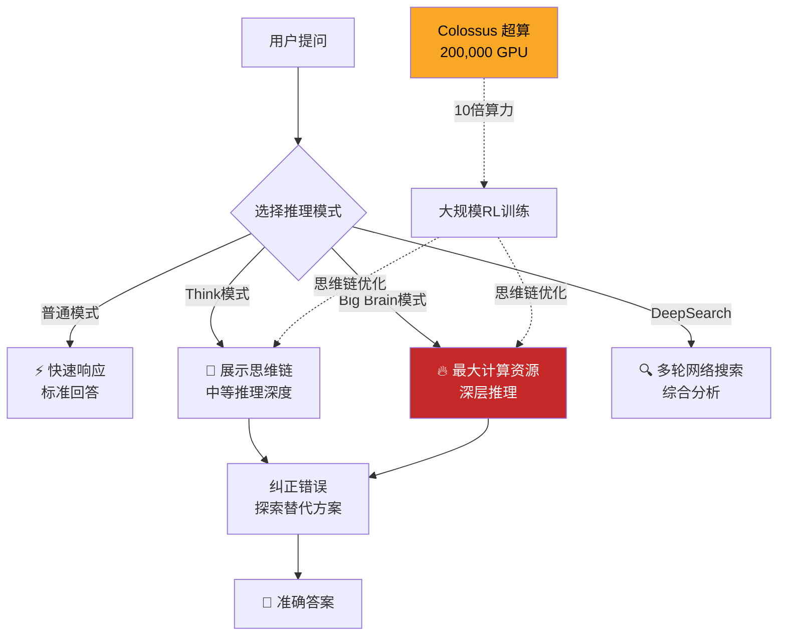

> 📊 难度：⭐⭐⭐ | ⏱️ 阅读：10分钟 | 📅 2025年2月17日 | 🏷️ Grok 3, xAI, 推理模型, Colossus超算

# 🧠 Grok 3 Beta — The Age of Reasoning Agents
# Grok 3测试版——推理智能体时代的到来

## 📝 一句话摘要

xAI发布Grok 3，这是在Colossus超算集群上以10倍于前代的算力训练的推理模型，凭借大规模强化学习实现了在数学、编程和科学推理方面的领先表现，开启了"推理智能体"的新时代。

---

## 📖 核心内容

### 🚀 十倍算力的飞跃

2025年2月17日，Elon Musk旗下的xAI正式发布了其旗舰AI模型Grok 3。这款模型的训练规模达到了前所未有的水平——在xAI自建的Colossus超算集群上，动用了约200,000块GPU，训练算力是前代Grok-2的10倍。

Colossus是xAI为训练前沿AI模型而专门建造的超级计算集群，其规模使得xAI在短时间内从AI领域的新进入者跃升为基础设施方面的领先力量之一。

### 🧩 推理能力：从"回答"到"思考"

Grok 3最核心的突破在于推理能力的质变。通过大规模强化学习（Reinforcement Learning）对思维链过程进行精细化训练，Grok 3能够从秒级到分钟级地进行深度思考——纠正错误、探索替代方案、最终给出准确答案。

xAI发布了两个推理变体：
- **🧠 Grok 3 (Think)**：具备完整推理能力的旗舰模型，可展示思考过程
- **⚡ Grok 3 mini (Think)**：轻量级推理模型，在速度和推理深度之间取得平衡

### ✨ 特色功能

**🧠 Think模式**：用户可以开启Think模式来启用推理功能，模型会显示其思维链过程，让用户看到AI是如何一步步推导出答案的。

**🔥 Big Brain模式**：针对特别复杂的问题，Big Brain模式会调用更多的计算资源，进行更深层次的推理。这种"按需扩展推理深度"的设计体现了测试时计算（test-time compute）的核心理念。

**🔍 DeepSearch**：深度搜索功能，能够在互联网上进行多轮、多步的信息检索和综合分析，为用户提供经过深度推理的搜索结果。

### 📊 基准测试表现

Grok 3在学术基准和真实用户偏好评估中均展现了领先表现：

- **🏆 Chatbot Arena Elo评分**：1402分，展示了在真实用户互动中的竞争力
- **🔢 AIME 2025（美国数学邀请赛）**：在最高测试时算力（cons@64）条件下，Grok 3 (Think)取得了93.3%的成绩
- **🔬 GPQA（博士级科学问题）**：超越了OpenAI的GPT-4o
- **🧮 数学推理**：在AIME等数学推理基准上表现突出
- **💻 编程能力**：显著提升的代码生成和理解能力

### 🌐 发布与可用性

Grok 3通过以下渠道提供：
- X平台Premium和Premium+用户可直接使用
- Premium+用户可额外使用Think和DeepSearch功能
- Grok.com网页版
- iOS和Android应用
- 后续通过xAI企业API对外开放

2025年2月20日，Grok 3曾短暂向免费用户开放体验。

---

## 🔧 技术要点

1. **200,000 GPU Colossus集群**：xAI自建超算基础设施，训练算力达前代10倍，体现了"暴力美学"的扩展路线
2. **大规模强化学习驱动推理**：通过RL精细化思维链过程，实现从秒级到分钟级的自适应推理深度
3. **AIME 93.3%（cons@64）**：在数学推理基准上的顶级表现，证明了扩展测试时计算的有效性
4. **Think/Big Brain分级推理**：按需调整计算资源投入，在响应速度和推理深度之间实现灵活权衡
5. **DeepSearch多步搜索推理**：将推理能力与信息检索深度结合，代表了搜索增强生成（RAG）的高级形态

---

## 🧩 深度解读

### 🟢 通俗版

想象你有两种方式问路：一种是随便问一个路人（普通AI），他凭记忆快速指个方向，可能对也可能错。另一种是请一位侦探（Grok 3 Think模式）——他会先查地图、再问当地人、然后核实信息、最后给你一个经过验证的路线。如果路特别复杂，你还可以开启"超级侦探模式"（Big Brain），调动更多资源来找最优路线。而 Grok 3 的底气来自它的"总部"——一个有 20 万台超级电脑的基地（Colossus），比上一代强 10 倍。这就像从一个小侦探社升级成了全球最大的情报机构。

### 🔴 深入版

Grok 3的发布标志着xAI从"追赶者"正式转变为"竞争者"。2023年底xAI发布第一代Grok时，还被普遍视为一个带有实验性质的项目；而Grok 3的出现，尤其是其在数学推理和Chatbot Arena上的表现，证明了xAI已经具备训练前沿模型的能力。

最值得关注的是xAI的基础设施战略。在短短一年多的时间里建成拥有200,000块GPU的Colossus集群，这种"先建算力、再做模型"的路径与其他AI公司形成了鲜明对比。这种策略的底层逻辑是：如果scaling law继续成立，那么拥有最大算力的一方就拥有最大的潜力。

Grok 3的推理功能设计也很有特色。Think模式和Big Brain模式的分级设计，本质上是将测试时计算的选择权交给了用户。这比OpenAI的o1模型更加透明——用户可以明确选择投入多少计算资源来换取更深的推理。

然而，xAI的挑战也很明显：相比OpenAI和Anthropic，xAI的模型主要通过X平台分发，生态系统相对封闭。Grok 3能否在企业级市场获得足够的采用率，将决定xAI的长期竞争力。

---

## 💭 延伸思考

1. 200,000块GPU的集群规模是否代表了AI训练基础设施的新基线？其他公司是否有能力和意愿匹配这一规模？
2. "推理智能体"的概念如何与传统的AI Agent框架结合？深度推理+工具调用的组合将带来怎样的应用可能性？
3. xAI的发展轨迹（从零到前沿只用了约两年）对AI创业公司有什么启示？资本+算力是否是唯一的成功路径？
4. Grok与X平台的深度绑定是优势还是限制？当AI助手成为平台核心功能时，社交媒体的形态将如何演变？

---

## 🔗 原文链接

[Grok 3 Beta — The Age of Reasoning Agents](https://x.ai/news/grok-3)

发布日期：2025年2月17日
