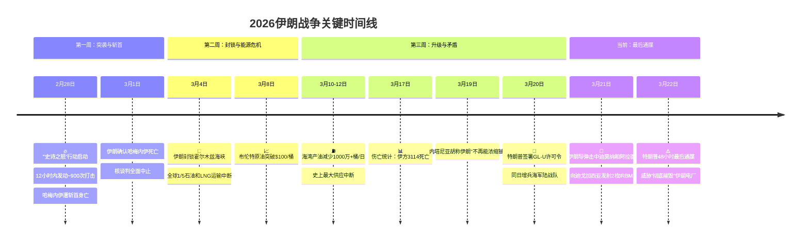
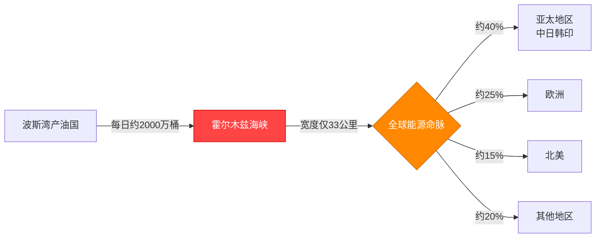
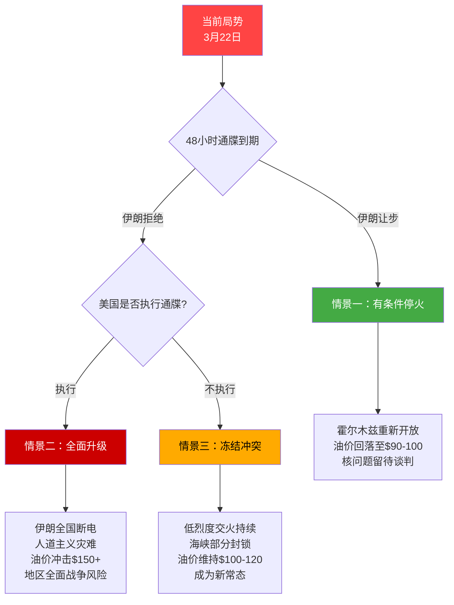

# 🔴 第23天：伊朗战争走向失控边缘——从斩首行动到霍尔木兹危机的全景解析

> **深度分析 | 2026年3月22日 | 约4200字**

---

## 📌 导读

2026年2月28日，美以联军以"史诗之怒"行动（Operation Epic Fury）对伊朗发动突袭，最高领袖哈梅内伊遭斩首，霍尔木兹海峡被封锁，全球油价飙升至126美元。23天后的今天，特朗普在"缓和"与"升级"之间反复横跳：一边签署行政令解冻伊朗石油，一边向德黑兰发出48小时"毁灭"最后通牒。伊朗导弹已击中以色列迪莫纳核设施附近城镇，并首次向美军印度洋基地迪戈加西亚发射中程弹道导弹。这场战争正在从区域冲突滑向全球性危机。

---

## 🗺️ 一图看懂：23天战争关键节点

---

## 🔴 当前态势：48小时内发生了什么（3月21-22日）

### 3月21日（第22天）：伊朗的报复性打击

| 事件 | 细节 |
|------|------|
| **迪莫纳-阿拉德遇袭** | 伊朗导弹击中以色列南部迪莫纳（核设施所在地）和阿拉德，造成**100余人受伤** |
| **迪戈加西亚遇袭** | 伊朗向印度洋美军基地迪戈加西亚发射**2枚中程弹道导弹（IRBM）**，均未命中 |
| **战略意义** | 这是伊朗首次对美军海外基地实施远程弹道导弹打击，射程超过**4,000公里** |

> ⚠️ **关键信号**：迪戈加西亚打击虽然未命中，但标志着伊朗将打击范围从区域内扩展至全球，这一升级的战略意义远超其军事效果。

### 3月22日（第23天）：特朗普的最后通牒

特朗普在社交媒体发表声明，向伊朗发出**48小时最后通牒**：

> "如果伊朗不在48小时内重新开放霍尔木兹海峡，我们将**彻底摧毁（obliterate）**伊朗所有发电设施。"
> —— 唐纳德·特朗普，2026年3月22日

这意味着：若通牒生效，伊朗9000万人口将面临**全面断电**的人道主义灾难。

---

## 📊 战争全景：23天数据总览

| 维度 | 战前基准 | 当前状态 | 变化幅度 |
|------|---------|---------|---------|
| 布伦特原油 | $75-80/桶 | $112/桶（峰值$126） | **+40%-67%** |
| 海湾日产量 | ~2500万桶/日 | 减少1000万+桶/日 | **-40%** |
| 伊朗死亡人数 | — | 3,114人（含1,354平民） | — |
| 以色列死亡人数 | — | 10+ | — |
| 霍尔木兹海峡 | 正常通行 | 完全封锁（第18天） | **全球1/5油气中断** |
| 伊朗核设施 | 4座浓缩设施运行 | 7座核设施遭打击 | **IAEA完全断联** |
| 航空燃油成本 | 基准价 | 翻倍 | 联合航空年增**$110亿** |

---

## ☢️ 核问题的关键变量：最大的已知未知

### 战前核库存

伊朗在开战前拥有的核材料令人警惕：

| 指标 | 数值 | 意义 |
|------|------|------|
| 60%浓缩铀库存 | **440.9公斤** | 约足够制造**9枚核武器** |
| 声明浓缩设施 | 4座 | 纳坦兹、福尔多等 |
| 遭打击核设施 | 7座 | 超出已知声明数量 |
| IAEA当前访问权限 | **零** | 所有设施均无法进入 |

### 三个核心不确定性

**1️⃣ 库存去向不明**

科学与国际安全研究所（ISIS）评估认为伊朗的浓缩能力已"被严重削弱（significantly set back）"，但——

> 440.9公斤60%浓缩铀的**实际去向不明**。在IAEA完全失去准入权的情况下，没有任何独立机构能够核实这些材料是否被销毁、转移还是隐藏。

**2️⃣ 内塔尼亚胡的声明未经验证**

3月19日，内塔尼亚胡宣称伊朗"已不再具备铀浓缩能力"。这一声明：
- ❌ 未获IAEA证实
- ❌ 未获美国情报机构背书
- ❌ 与IAEA"无法进入任何设施"的声明矛盾

**3️⃣ 未声明设施的可能性**

7座遭打击设施已**超过4座已声明设施数量**，暗示美以情报机构掌握了伊朗未向IAEA申报的秘密核设施信息。这反过来引出一个更令人不安的问题：**是否还有更多未被发现的设施？**

---

## ⛽ 霍尔木兹海峡：能源武器化的全球代价

### 为什么霍尔木兹海峡如此重要？

### 油价冲击传导链

| 阶段 | 时间 | 油价 | 触发事件 |
|------|------|------|---------|
| 战前基准 | 2月27日前 | $75-80 | — |
| 首波冲击 | 2月28日-3月3日 | $85-95 | 斩首行动引发恐慌 |
| 封锁冲击 | 3月4日-7日 | $95-100 | 霍尔木兹封锁 |
| 恐慌峰值 | 3月8日-12日 | **$126** | 海湾减产1000万+桶/日 |
| 当前水平 | 3月20日 | $112 | GL-U许可令微幅缓解 |

国际能源署（IEA）将此次危机定性为：

> "**人类历史上最严重的全球能源安全挑战。**"
> —— IEA，2026年3月

### 特朗普GL-U许可令的杯水车薪

3月20日，特朗普签署通用许可令U（General License U），解冻海上约**1.4亿桶**伊朗石油的制裁限制。但这一数字的实际意义极为有限：

| 对比项 | 数值 |
|--------|------|
| GL-U释放量 | 1.4亿桶 |
| 全球日消费量 | ~1亿桶 |
| GL-U可维持天数 | **仅1.4天** |
| 海湾日减产量 | 1000万+桶 |
| GL-U占减产比 | 约14天补偿量 |

**结论**：GL-U是一个政治姿态，而非能源解决方案。在霍尔木兹海峡持续封锁的情况下，它对油价的压制作用极为短暂。

---

## 🔄 特朗普的矛盾信号：3月20-21日的政策精神分裂

3月20-21日是本轮危机中最令分析人士困惑的48小时。特朗普政府在同一时间窗口内释放了完全相互矛盾的信号：

### 缓和 vs 升级对照表

| "缓和"信号 | "升级"信号 |
|------------|------------|
| 称"正在考虑收缩行动" | 同日**增派海军陆战队** |
| 签署GL-U解冻伊朗石油 | 继续对伊朗本土实施空袭 |
| 暗示愿意谈判 | 3月22日发出48小时毁灭性通牒 |

### 美国国内的激烈反应

保卫民主基金会（FDD）——传统的鹰派智库，罕见地公开抨击特朗普：

> "解冻伊朗石油储备等于**资助敌人（funding the enemy）**——这是**可耻的愚蠢行为（shamefully stupid）**。"
> —— FDD声明，2026年3月20日

这一表态的重要性在于：FDD通常是最坚定的对伊强硬派，连他们都认为特朗普的政策自相矛盾。

### 可能的解读

| 假设 | 逻辑 |
|------|------|
| **故意模糊** | 同时保留谈判和打击的选项空间 |
| **内部分裂** | 国防部主战派与财政部务实派的政策拉锯 |
| **纯粹混乱** | 决策过程缺乏协调，各部门各行其是 |
| **极限施压2.0** | 以矛盾信号制造对手判断困难，迫使伊朗就范 |

无论哪种解读，结果是一样的：**盟友困惑、对手误判风险飙升、市场剧烈震荡。**

---

## 🌐 大国博弈：看不见的第二战场

### 俄罗斯：从"中立"到直接军事配合

最具爆炸性的情报披露来自CNN：

> **俄罗斯正在向伊朗传递美军坐标信息。**
> —— CNN确认，2026年3月

更关键的是俄方的**交换条件**：

> 俄罗斯表示愿意停止对伊情报支援——条件是美国**停止对乌克兰的军事援助**。

这一交易提议直接将伊朗战场与乌克兰战场**战略耦合**，标志着一种新型大国博弈范式的出现：两场看似无关的区域冲突通过大国的棋盘操作变成了**联动筹码**。

### 中国：战略模糊的最大受益者？

| 中国立场 | 具体行动 |
|---------|---------|
| 外交层面 | 呼吁停火，措辞温和 |
| 联合国表态 | 在安理会相关决议中**投弃权票** |
| 军事合作 | 伊朗确认从中国获得"军事合作" |
| 能源利益 | 作为伊朗石油最大买家，高度关注局势 |

中国的策略本质上是**"三不"**：不公开反对美国、不放弃伊朗、不承担调停责任。在大国中维持最大的行动灵活性。

### 以色列：战略目标与战术风险

内塔尼亚胡政府的核心算盘是：

- ✅ 消除伊朗核威胁（已声称达成，但未验证）
- ✅ 斩首伊朗最高领导层
- ❌ 但未能阻止伊朗导弹打击本土（迪莫纳和阿拉德遇袭）
- ❌ 引发全球能源危机，损害与海湾盟友关系

3月21日迪莫纳遇袭的象征意义极为沉重——迪莫纳是以色列自身核设施所在地，伊朗的打击目标选择具有明确的**核威慑对等信号**。

---

## 💔 人道主义代价：数字背后的生命

### 伤亡统计（截至约3月17日）

| 类别 | 伊朗 | 以色列 |
|------|------|--------|
| 死亡总数 | **3,114** | 10+ |
| 其中平民 | 1,354 | — |
| 其中军人 | 1,138 | — |
| 其中儿童 | **200+** | — |
| 受伤 | **18,000+** | 100+ |

### 不对称的代价

伊朗与以色列的伤亡比超过**300:1**。

这一数字需要放在两个背景下理解：

**背景一**：美以联军拥有压倒性的精确打击能力和空中优势，而伊朗的防空体系在开战首日即遭到系统性瘫痪。900次打击在12小时内完成——这意味着平均每**48秒**就有一次打击发生。

**背景二**：如果特朗普的48小时通牒付诸实施，摧毁伊朗发电设施将使9000万人口失去电力供应，医院、供水系统和通信网络将全面瘫痪。人道主义代价将呈**几何级数增长**。

---

## 🔮 三种可能走向：情景推演

### 情景一：有条件停火（概率：15-20%）

**前提条件**：伊朗在48小时内部分开放霍尔木兹海峡，换取美国停止空袭。

- 油价可能回落至$90-100区间
- 核问题进入长期谈判轨道
- **障碍**：伊朗已失去最高领袖，内部权力真空使任何谈判缺乏授权主体

### 情景二：全面升级（概率：30-35%）

**触发条件**：伊朗拒绝通牒且美国执行威胁，摧毁伊朗电力基础设施。

- 油价可能冲击$150甚至更高
- 伊朗可能对沙特、阿联酋石油设施实施报复性打击
- 真主党、胡塞武装全面开辟第二战场
- 全球经济衰退概率急剧上升

### 情景三：冻结冲突（概率：45-50%）

**最可能的路径**：美国不完全执行通牒，但维持军事压力；伊朗维持部分封锁但避免进一步升级。

- 类似当前态势的长期化
- 油价维持在$100-120的"新常态"
- 全球经济承受持续性通胀压力
- **这也是最危险的情景**——因为长期低烈度冲突随时可能因一次误判而升级

---

## 💰 对全球经济的传导链：这场战争如何影响每一个人

### 从霍尔木兹到你的钱包

| 传导环节 | 具体影响 |
|---------|---------|
| **油价** | 从$75-80飙升至$112，消费者加油成本增加40%+ |
| **航空** | 航空燃油价格翻倍，仅联合航空一家年增成本**$110亿** |
| **物流** | 全球航运绕道好望角，运费上涨，交货周期延长 |
| **通胀** | 能源价格推升全球CPI，各国央行面临加息压力 |
| **粮食** | 化肥原料价格上涨，波及全球农业成本 |
| **制造业** | 石化原料涨价，从塑料到药品全产业链受影响 |
| **金融市场** | 避险情绪推高黄金、美债，新兴市场资本外流 |

### 对亚太地区的特殊冲击

亚太是波斯湾石油的**最大进口区域**，中国、日本、韩国、印度对霍尔木兹海峡的依赖度远超欧美。海峡封锁对亚太的影响是全球均值的**1.5-2倍**。

---

## ✍️ 结语：历史的断层线

23天前，一次精心策划的斩首行动在12小时内改写了中东地缘格局。但斩首了领袖，并未斩断冲突的根源。

今天我们看到的是一幅深刻矛盾的图景：

- 声称"设定落日"的发起者在**增兵**
- 解冻敌方石油的同一只手在签署**毁灭性通牒**
- 宣称核威胁已消除，却**无人能独立验证**
- 440.9公斤浓缩铀去向不明——这是装在薛定谔箱子里的**核材料**

IEA将这场危机称为"历史上最严重的能源安全挑战"。但真正最严重的挑战不在能源，而在于：**当世界上最强大的军事力量以矛盾信号指挥一场没有明确终局的战争，误判的概率不是在降低，而是在累积。**

每一天不停火，累积误判的概率就增加一分。迪戈加西亚的两枚中程导弹虽然没有命中，但下一次呢？

48小时倒计时已经开始。

---

*本文基于截至2026年3月22日的公开情报源撰写。战争态势瞬息万变，文中数据和评估可能随事态发展而需更新。*

*数据来源：IEA、IAEA、ISIS（科学与国际安全研究所）、FDD、CNN及各方官方声明。*
